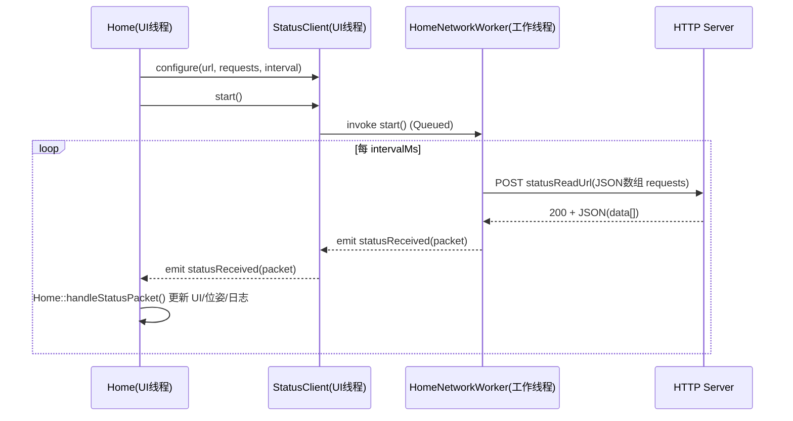
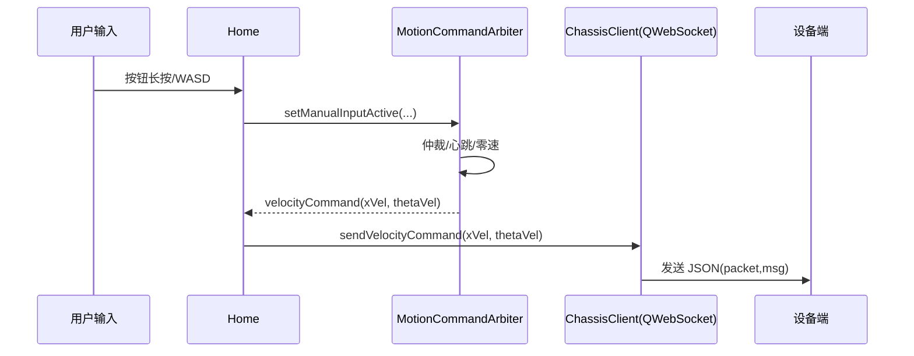
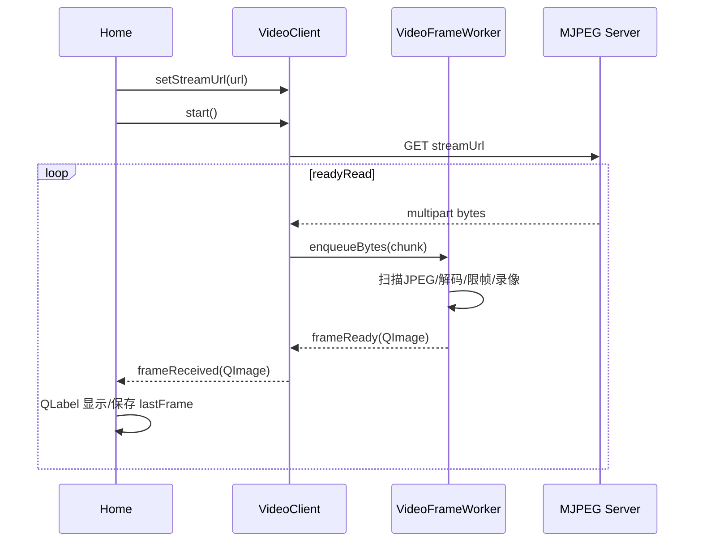

# 架构与核心数据流

## 1. 模块分层（按职责拆分）

- **UI 容器层**：`MainWindow`（`mainwindow.h/.cpp` + `mainwindow.ui`）
- **页面编排层**：`Home` / `Map` / `Maintenance` / `Help` / `About`
- **业务模块层（已拆分）**
  - `HomeStatusPresenter`：状态包解析与状态区 UI 映射
  - `ControlSessionCoordinator`：地图版本、会话及手动/自动交接
  - `HomeManualInputState`：按钮/键盘手动运动输入状态
  - `HomeGimbalKeyState`：云台键盘组合键状态与动作解析
  - `HomeVideoPresenter`：首页视频 QLabel 占位、缩放、最新帧显示
  - `StatusClient`：状态轮询编排（线程封装）
  - `HomeNetworkWorker`：真正执行 HTTP 轮询的 worker（跑在 QThread）
  - `NetworkPolicy`：Bearer Header、JSON 请求构造、指数退避策略
  - `StatusProtocol`：状态字段枚举与地址映射、默认轮询请求构造
  - `ChassisClient`：WebSocket 协议封装（cmd_vel/reboot/stopLocation…）
  - `VideoClient`：MJPEG 拉流、解码、录像、截图、自动重连
  - `TaskCompiler`：将三种任务模式编译为工控机执行步骤
  - `RoutePathFinder`：路径搜索（加权最短路）
  - `MapRoutePlanner`：地图路径边到 `RoutePathFinder` 的适配，并应用 `routePlanning` 配置
  - `MapGeometry`：地图/标准坐标转换、角度归一化、polyline 长度等纯几何工具
  - `MapDocument`：地图 JSON 文档模型编解码
- **配置层**：`ConfigManager`（`config.json`）
- **日志层**：`LoggingManager`（Qt message handler + 异步文件写入）
- **构建边界**：CMake 内部库拆为 `tenco_config`、`tenco_logging`、`tenco_storage`、`tenco_motion`、`tenco_map_model`、`tenco_network`、`tenco_video`

这样拆分的核心价值（企业常用思路）：

- UI 不直接散落网络/协议细节，降低“改 UI 导致协议被改坏”的概率
- 各模块可以被单测覆盖（尤其 `TaskCompiler`、`ConfigManager`、`RoutePathFinder`、`StatusProtocol`、`MapDocument`）

---

## 2. 线程模型（非常关键）

### 2.1 UI 线程

通常包含：

- `MainWindow`
- `Home` / `Map`
- `ChassisClient`（QWebSocket）
- `VideoClient`（QNetworkAccessManager，回调在创建它的线程）

### 2.2 工作线程

- `HomeNetworkWorker` 在 `StatusClient` 创建的 `QThread` 中运行
- 负责周期性 HTTP 请求，避免 UI 被网络阻塞
- `VideoFrameWorker` 在 `VideoClient` 的帧处理线程中运行
- 负责 MJPEG 扫描、解码、限帧、录像和指标统计，UI 只接收最新帧
- `LoggingManager` 使用后台 LogWriterThread 写文件和审计日志，Qt message handler 不再同步写磁盘

---

## 3. 核心链路：状态轮询（HTTP）

对应代码：

- 轮询线程封装：`statusclient.h/.cpp`
- 轮询 worker：`homenetworkworker.h/.cpp`
- 解析与 UI 更新：`Home::handleStatusPacket()`（`home.cpp`）

---

## 4. 核心链路：手动控制（WebSocket cmd_vel）

对应代码：

- 运动仲裁：`MotionCommandArbiter`（`motioncommandarbiter.h/.cpp`）
- 协议封装：`ChassisClient::sendVelocityCommand()`（`chassisclient.cpp`）

---

## 5. 核心链路：视频（HTTP MJPEG）

对应代码：

- 拉流与重连：`videoclient.h/.cpp`
- 解码、录像、最新帧、限帧与指标：`videoframeworker.h/.cpp`
- UI 显示/录像/截图：`home.cpp`

---

## 6. 工控机自动闭环与手动直连

Map → TaskCompiler → TrackingClient 上传完整计划。用户获取会话并明确启动后，ControlSessionCoordinator 清除手动输入并等待底盘停稳、释放控制权；tracking_node 校验短期许可、坐标/标定版本并执行任务。状态与事件回读不驱动本地运动。

fusion_node 通过 ROS 向 tracking_node、通过 HTTP 向 PoseClient 发布同一份控制位姿；位姿寄存器不再参与控制链路。MotionCommandArbiter 只处理手动输入、松键停止和心跳，ChassisClient 在直接获取底盘手动许可后发送既有 cmd_vel。

JsonHttpClient 限制每条请求通道的并发、报文大小和超时。写请求采用不可回放的请求体；响应丢失时通过 requestId 查询结果。ExternalEventCoordinator 只执行停车后的拍摄业务，持久化意图和结果，未知结果要求人工核对。

详情见 [工控机闭环操作与接口](工控机闭环操作与接口.md)。
