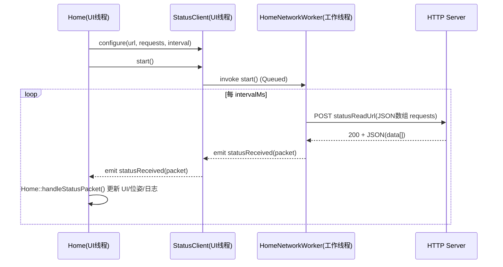
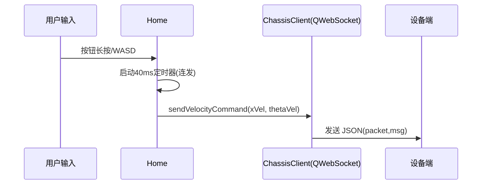
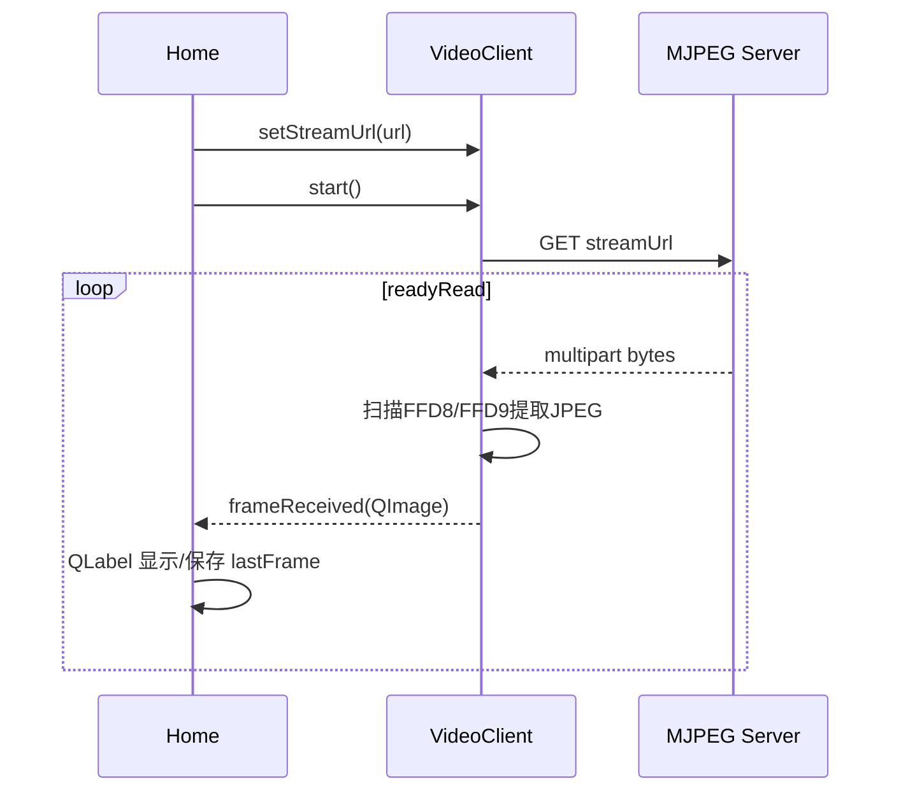
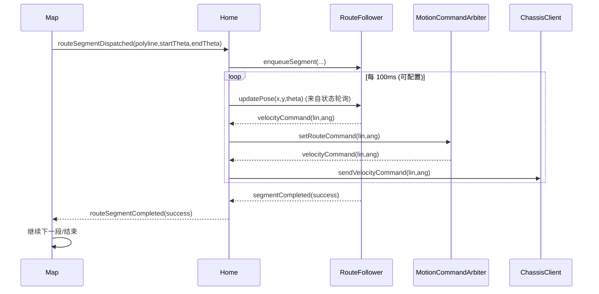

# 架构与核心数据流

## 1. 模块分层（按职责拆分）

- **UI 容器层**：`MainWindow`（`mainwindow.h/.cpp` + `mainwindow.ui`）
- **页面编排层**：`Home` / `Map` / `Maintenance` / `Help` / `About`
- **业务模块层（已拆分）**
  - `HomeStatusPresenter`：状态包解析与状态区 UI 映射
  - `StatusClient`：状态轮询编排（线程封装）
  - `HomeNetworkWorker`：真正执行 HTTP 轮询的 worker（跑在 QThread）
  - `StatusProtocol`：状态字段枚举与地址映射、默认轮询请求构造
  - `ChassisClient`：WebSocket 协议封装（cmd_vel/reboot/stopLocation…）
  - `VideoClient`：MJPEG 拉流、解码、录像、截图、自动重连
  - `RouteFollower`：路线段跟随算法（输出速度命令，不直接发网络）
  - `RoutePathFinder`：路径搜索（加权最短路）
  - `MapDocument`：地图 JSON 文档模型编解码
- **配置层**：`ConfigManager`（`config.json`）

这样拆分的核心价值（企业常用思路）：

- UI 不直接散落网络/协议细节，降低“改 UI 导致协议被改坏”的概率
- 各模块可以被单测覆盖（尤其 `RouteFollower`、`ConfigManager`、`RoutePathFinder`、`StatusProtocol`、`MapDocument`）

---

## 2. 线程模型（非常关键）

### 2.1 UI 线程

通常包含：

- `MainWindow`
- `Home` / `Map`
- `ChassisClient`（QWebSocket）
- `VideoClient`（QNetworkAccessManager，回调在创建它的线程）

### 2.2 工作线程

- `HomeNetworkWorker` 在 `StatusClient` 创建的 `QThread` 中运行
- 负责周期性 HTTP 请求，避免 UI 被网络阻塞

---

## 3. 核心链路：状态轮询（HTTP）

对应代码：

- 轮询线程封装：`statusclient.h/.cpp`
- 轮询 worker：`homenetworkworker.h/.cpp`
- 解析与 UI 更新：`Home::handleStatusPacket()`（`home.cpp`）

---

## 4. 核心链路：手动控制（WebSocket cmd_vel）

对应代码：

- 连发定时器：`Home::*RepeatTimer`（`home.h/.cpp`）
- 协议封装：`ChassisClient::sendVelocityCommand()`（`chassisclient.cpp`）

---

## 5. 核心链路：视频（HTTP MJPEG）

对应代码：

- 拉流与解码：`videoclient.h/.cpp`
- UI 显示/录像/截图：`home.cpp`

---

## 6. 核心链路：地图路线执行闭环

对应代码：

- Map 发起分段：`Map::dispatchNextEdge()`（`map.cpp`） → `routeSegmentDispatched` 信号
- Home 编排：`Home::followRouteSegment()`（`home.cpp`）
- 跟随算法：`routefollower.h/.cpp`
- 运动安全仲裁：`motioncommandarbiter.h/.cpp`，统一手动/路线速度、心跳、零速和安全停车 reason
- 发送速度：`ChassisClient`（`chassisclient.h/.cpp`）
