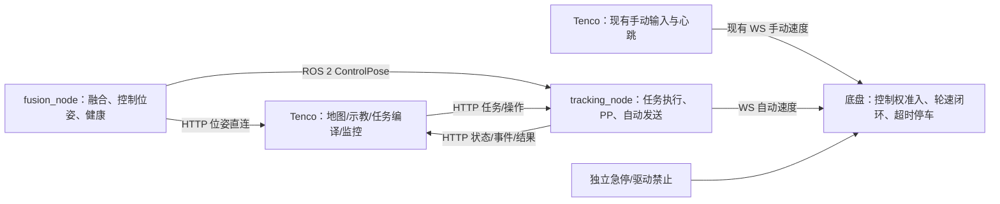
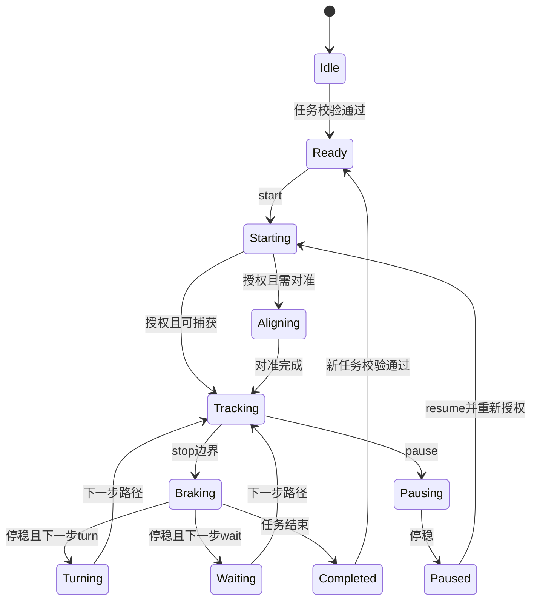

> 历史方案：涉及底盘授权、上位机保活、控制权交接的条款已由 2026-09-18 [总体方案 V3](工控机闭环系统总体方案V3.md) 替代。此文件只保留历史设计记录。

# 工控机控制闭环与位姿直连系统开发方案

> 版本：v2.0（完整修订版）
>
> 日期：2026-09-15
>
> 范围：Tenco（Windows / Qt 6 / C++20）、工控机（Ubuntu / ROS 2 / sensor_fusion）、底盘接口联调。
>
> 状态：开发设计；本文中的新增接口、状态和验收指标均为待实现规格，不表示设备已经具备相应能力。
>
> 关联：[多垄穿梭作业闭环系统开发方案](https://github.com/DAC-Code25/Tenco/blob/master/docs/develop/多垄穿梭作业闭环系统开发方案.md)、[统一运动安全层开发方案](https://github.com/DAC-Code25/Tenco/blob/master/docs/develop/统一运动安全层开发方案.md)。与本文涉及的执行位置、控制权和接口定义冲突时，以本文为准。

## 1. 决策、目标与边界

### 1.1 已确定的架构决策

1. **自动跟踪全部放在工控机**：采用标准 Pure Pursuit，配合速度规划、对准、制动、转向和任务执行状态机。
2. **Tenco 负责规划与任务下发**：保留地图编辑、示教、路径搜索、任务配置、操作和监控；自动任务开始后，精确停车、检查点触发和步骤切换由工控机执行。
3. **删除 RouteFollower**：删除其源码、构建项、测试、调用链、自动控制参数和死代码；不保留 `ipc/local` 切换或隐藏回退控制器。
4. **手动控制保持独立直连**：键盘、按钮、速度设置、松键停车与心跳仍由 Tenco 经现有 WebSocket 通道直接发送到底盘，不经过 tracking_node，不新增工控机手动速度转发接口。
5. **两路运动通道、一个有效控制权**：底盘负责最终命令准入；上位机和工控机各自落实发送侧互锁。人工接管不能依赖 tracking_node 在线。
6. **统一位姿权威来源**：fusion_node 生成带坐标版本、时间和健康信息的控制位姿；工控机内部通过 ROS 2 获取，Tenco 通过 HTTP 直连获取。
7. **三种自动模式共用执行器**：常规路线、单垄往返、多垄作业编译成同一种任务步骤，不分别开发控制算法。
8. **任务预下载**：第一版完整校验并预装载一次任务的全部步骤；连续路径衔接不依赖上位机实时发送下一段。

“手动保持直连”约束的是手动输入体验、指令路径和正常速度报文。为避免与新增自动发送者竞争，必须增加控制权确认和发送互锁。不能用保留旧调用行为作为双通道可以同时发送的理由。

### 1.2 验收目标

| 目标 | 完成定义 |
|---|---|
| 自动闭环本地化 | 跟踪计算和动作执行不依赖 Windows 定时器或上位机逐帧位姿回传 |
| 手动独立可用 | tracking_node 停止、崩溃或重启时，底盘在线且安全条件满足后仍可从 Tenco 直连接管 |
| 命令互斥 | 底盘只接受当前控制权代次的运动命令；旧自动报文不能覆盖人工接管或急停 |
| 任务完整 | 普通路线、单垄往返、检查点停留、多垄转场/转向、暂停恢复均有明确执行结果 |
| 位姿可判定 | 能区分新估计、旧位置重复发布、定位退化、源失联和坐标版本不匹配 |
| 无重复执行链 | Tenco 无 RouteFollower、无本地自动速度输出、无旧 row-work 运行协议 |
| 精度可验证 | 同时提供内部控制误差和独立实车测量；以第 16 节规定的条件验收 |

### 1.3 非目标

- 不引入 Nav2、rosbridge 或 Windows ROS 运行时。
- 不把 Dijkstra 改为 A*，不顺带改图搜索代价模型。
- 不开发第二套手动控制服务，不把手动速度转发经过工控机。
- 不实现运动中热切换原点，不自动把旧地图重新解释成新原点地图。
- 不在本次重写 UKF/EKF 核心、不改变视觉观测接入路径；控制位姿适配和健康导出属于本次范围。
- 第一版自动任务只支持**前进行驶和原地转向**。单垄返程采用端点转向后沿反向点列前进；手动倒车继续保留。自动倒车字段直接拒绝，避免提供未实现的开关。
- 不新增动态绕障规划。底盘已有障碍物/安全保护必须接入自动启停条件；若设备不具备此能力，第一版使用范围限定为经现场确认的受控作业区域。

## 2. 当前实现与改造基线

### 2.1 已从工作区确认的事实

| 模块 | 当前实现 | 本次处理 |
|---|---|---|
| `Tenco/routefollower.*` | 追逐路径点的比例控制，已有起终点对准、速度和加减速限制 | 删除，职责迁入工控机 |
| `Tenco/motioncommandarbiter.*` | 仲裁上位机进程内的路线/手动输入；不能约束远端另一个发送者 | 保留手动输入/心跳/停止能力，删除路线分支，增加直连通道发送许可 |
| `Tenco/chassisclient.*` | 向 `:1202` 发 `cmd_vel`，连接时还会发送定位/脚本启动消息 | 保留手动速度协议；校核重连、启动消息对自动执行的影响 |
| `Tenco/statusprotocol.cpp` | 从 `:9999/table/reads` **读取** `100` 位姿寄存器 | 改为只轮询底盘遥测，位姿使用 PoseClient |
| `network_sender.cpp` | 向底盘 `100` 寄存器写融合位姿，还有预测/限跳/坐标变换等输出处理 | 审计有效处理后迁入统一输出适配层，移除旧底盘位姿发送器 |
| `Tenco/rowworkclient.*` | 调用 `:18120/row-work/*`，包含计划、状态和位姿采样请求 | 用统一 TrackingClient、PoseClient 替代，删除旧客户端 |
| `RowWorkPlan` / `RowMissionPlan` | 单垄参数、检查点、多垄步骤模型和编辑功能已存在 | 保留文件模型并升级版本；新增任务编译器 |
| 多垄执行 | `RowMissionPlan` 是计划模型；工作区未见完整多垄运行执行器 | 本次新增工控机任务执行器，不按“已有状态机小改”估算 |
| `sensor_fusion` | CMake/package.xml 使用 ROS 2、ament_cmake、rclcpp，已有里程计输出 | 按 ROS 2 实施；README 中旧 ROS 1 描述同步修订 |
| 底盘固件与 row-work 服务 | 当前工作区没有底盘服务端控制代码，也未找到 row-work 服务实现 | 不把客户端字段当作底盘能力证明；必须完成协议和实车联调 |

上位机读取、融合端写入同一寄存器，不等于两个写入者争写。底盘自己的定位模块是否还在写 `100`，需通过设备侧证据核实。位姿直连的确定收益是：移除中间寄存器缓存，携带真实时间与健康信息，缩短自动控制链路。

写接口使用 `len=3`，读接口使用 `len=12`；两个接口可能分别以元素数和字节数计量，不能仅据数字不同认定协议错误。

### 2.2 优先校准的参数

| 项目 | Tenco 配置 | 融合配置 | 处理 |
|---|---|---|---|
| 原点纬度 | 30.2229922 | 30.7064768 | 依据当前作业场地确定统一原点 |
| 原点经度 | 120.0228563 | 120.4976352 | 同上 |
| 左右轮中心距 | 0.58 m | 0.25 m | 实测并做差速旋转标定，禁止直接择一覆盖 |
| 轮径 | 0.18 m | 0.20 m | 确认有效滚动直径及编码器尺度 |
| 编码器尺度 | 配置含减速比 14.5 | 注释说明 wheelencode 已折算到轮端 | 核实 ticks 定义，避免重复乘除减速比 |

纬度差约对应 53.7 km 的南北距离，这是配置差异，不是本次测得的小车定位误差。`ekf_fusion.cpp` 的构造默认原点在正常初始化中会被 `setOrigin()` 覆盖，不视为第三个同时生效的原点。

### 2.3 代码实施基线

本方案文件位于工作区根目录；当前根目录不是 Git 仓库。本次修订只修改本文。后续代码实施时分别确认实际源码仓库、分支、配置入口、ROS 发行版及部署目录；Tenco 的开发遵循其 `AGENTS.md`。不得把另一个路径下的构建结果作为当前副本已验证的证据。

## 3. 总体架构与职责



### 3.1 职责划分

| 位置 | 负责 | 不承担 |
|---|---|---|
| Tenco | 路径搜索、路径几何、任务编译/下载、示教交互、参数编辑、任务操作、人工直连控制、业务拍摄与结果展示 | PP、自动速度规划、根据轮询进度实时决定停车或掉头 |
| fusion_node | 传感器融合、统一控制位姿、参考点转换、源年龄/可靠性、位姿 HTTP 服务与示教采样 | 路线选择、任务步骤、底盘运动命令 |
| tracking_node | 任务校验/执行、路径预处理、PP、速度规划、对准/制动/转向、执行保护、自动控制权租约 | 手动速度转发、地图编辑、全局寻路 |
| 底盘 | 人工优先准入、自动代次校验、命令有效期、驱动控制、急停/使能、实际运动遥测 | 上位机任务规划 |

### 3.2 架构不变量

- 位姿估计只有 fusion_node 一份；HTTP 与 ROS 是同一快照的两种传输方式。
- 自动速度只有 tracking_node 一个生产者；上位机源码不保留自动速度控制器。
- 手动速度始终直接进入底盘；tracking_node 故障不会堵住人工通道。
- 同一时刻底盘只接受一个有效所有者的普通运动命令；停止/急停具有独立优先级。
- 任务、位姿、原点、地图变换和车辆标定版本不匹配时，禁止自动启动。
- 网络超时、进程重启、故障复位均不自动恢复运动。
- 所有自动步骤复用同一个跟踪和停止实现。

### 3.3 网络端点

| 设备 | 地址/端口 | 用途 |
|---|---|---|
| 工控机 | `192.168.31.13:18131` | fusion_node `/api/v1/pose`、`/health`、示教采样 |
| 工控机 | `192.168.31.13:18130` | tracking_node 任务、控制、状态、事件、配置读取/原点协调 |
| 工控机本地 | ROS 2 `/sensor_fusion/control_pose` | tracking_node 唯一控制位姿输入 |
| 底盘 | `192.168.31.7:1202` | 原有手动 WS 和新增自动 WS 会话 |
| 底盘 | `192.168.31.7:9999` | 遥测、现有模式/配置接口及经验证的控制权能力 |
| 工控机 | `192.168.31.13:18080` | 现有视频/相机服务 |
| PLC | `192.168.31.120:502` | 现有云台控制 |

删除上位机对 `:18120/row-work/*` 的运行依赖。不部署第二套兼容作业网关。HTTP 前缀统一为 `/api/v1`，不同时维护无前缀别名和旧 `/segment` 接口。

## 4. 手动直连与自动控制权

### 4.1 安全边界与底盘逻辑契约

手动保持现有 `cmd_vel` 速度报文：

```json
{
  "packet": {"cmd": "region", "region": "cmd_vel", "index": 1},
  "msg": {"xvel": 0.25, "yvel": 0.0, "thetavel": 0.0, "isRemote": true}
}
```

底盘最终准入必须具备下列**逻辑能力**。这些名称是适配器职责，不代表当前设备已经提供同名 URL 或命令：

| 能力 | 要求 |
|---|---|
| `request_manual` | 可由 Tenco 直接调用；原子撤销自动发送许可、切入交接停止，排空/拒绝旧自动命令 |
| `acquire_auto` | 停稳、手动心跳关闭、故障已清、自动会话注册后授予新 `ownerEpoch` |
| `renew_auto` | 只允许当前自动会话续租，遥测读取、其他 WS 活动不能续租 |
| 自动报文隔离 | 通过会话绑定/代次令牌区分自动和现有手动报文；撤销后的旧连接/旧报文必须失效 |
| `stop_latched` | 急停或驱动禁止锁存后拒绝所有非零速度，解除本身不产生运动 |
| 权威状态回读 | 至少提供 owner、ownerEpoch、停止锁存、自动租约、最后接收命令及实际速度年龄 |

优先复用底盘已有模式/使能机制，但必须验证它确实能做到跨会话排他。仅写模式寄存器 `3c`、仅看连接在线或仅比较上位机本地标志，都不能替代上述能力。

若现有固件没有该能力，必须在底盘端补充最小命令准入逻辑，或使用可验证的独立模式/驱动互锁实现同等效果。**不会因此把手动通道改为经过工控机。** 在完成该能力前，可做仿真和隔离测试，不能把双通道自动接管验收标为通过。底盘源码不在当前工作区，能力对接作为明确外部交付项。

### 4.2 控制权状态

统一使用 `None / Manual / Auto / Stopping / Estop`。底盘 `ownerEpoch` 在每次授权、撤销或锁存时单调推进；底盘重启另有 `chassisBootId`。状态许可必须同时匹配 BootId 和 Epoch。

- 底盘 owner 是运动准入的权威；tracking 的 `controlOwner` 是带时间的镜像，不自行授予人工权限。
- 工控机仅在 owner=Auto、当前会话/代次匹配、租约有效且执行保护通过时发送自动非零速度。
- Tenco 仅在 owner=Manual 且本次直连交接确认完成后发送手动非零速度。
- 未持有许可时不周期发送“待机零速”，避免干扰另一个合法通道；全局急停使用专门停止机制。

### 4.3 自动切手动

1. 人工按下手动键或点击接管时，Tenco 锁住自动操作入口，可立即直发一次零速度以尽早请求停车；**该零速度不是完成接管的证据**。
2. Tenco 经直连底盘请求 `request_manual`。底盘撤销自动代次，禁止后续旧自动速度进入驱动，并制动。
3. Tenco 等待底盘新代次确认和有效停稳遥测；确认后原有键盘/按钮心跳才可输出非零速度。等待期间松开的按键不缓存重放。
4. Tenco 异步通知 tracking `manual_takeover`；即使通知不到，底盘也已经隔离旧自动指令。
5. tracking 从底盘权属变化或请求得知被接管，停止自动发送，将执行置为 `Paused`、原因为 `manual_takeover`，记录步骤与进度。
6. 松开所有手动键后沿用原有直连零速和停止心跳行为，保持 Manual，不自动恢复任务。

tracking_node 不在线时，步骤 2、3 仍由 Tenco 和底盘直接完成。底盘本身不在线或无法确认驱动停止时，界面显示“接管未确认”，不能将一次 send 成功显示为已停稳。

### 4.4 手动切自动

1. 用户明确选择任务启动/恢复。Tenco 清除按键与按钮保持状态，停止手动心跳，发零速，并处理本地 WS 待发队列。
2. 确认底盘停稳、手动发送禁用、任务版本与现场条件有效。Tenco 发送带预期执行/控制权版本的 `start` 或 `resume`。
3. tracking 校验任务、位姿、路径捕获范围、定位质量、原点和标定，再申请底盘新的 Auto 代次。
4. 底盘授予后，tracking 才从零速开始。旧 Manual 报文因会话/权属变化不能在授权后生效。
5. 任一步失败保持停车；不恢复之前按住的手动键，也不重放上次自动速度。

### 4.5 急停、故障与启动消息

- 界面“暂停”走任务减速停车；“急停”同时请求底盘锁存停止并通知 tracking，另保留设备独立急停/驱动禁止。
- 普通零速是一条运动请求，不等价于硬件急停或断电。急停响应必须测量实际轮速/驱动状态。
- `reset_fault`、底盘急停解除与 `resume/start` 分离。释放物理急停后仍保持停车。
- `ChassisClient` 当前连接时发送 `stopLocation` 和电机脚本消息；这些消息必须审核为安全的设备初始化步骤，自动运行时不能因 Tenco 重连而重复启动/停止底盘脚本。建立一次性初始化与模式准入规则。
- encoder 遥测 WS 会话不获得运动权限、不延长自动租约；不假定增加一个 WS 会话不会影响设备。

### 4.6 看门狗与时间预算

| 层级 | 检查内容 | 初始设计值/要求 |
|---|---|---|
| tracking 控制周期 | 位姿、会话、任务和保护状态 | 20 Hz，每个周期检查 |
| 自动发送截止期 | 只发送当前周期最新命令，禁止积压重放 | 命令有效期初值 150 ms，实际协议需底盘支持 |
| 底盘自动租约 | 无有效自动速度/续租即制动并撤销授权 | 初值 250 ms；通过链路测试后固化 |
| Tenco 操作会话 | 应用失联后 tracking 自动暂停 | 心跳 200 ms，失效 1000 ms；默认不无人续跑 |
| 手动失联 | 沿用直连心跳和底盘失联停止 | 需记录真实超时，验证松键、关闭程序及连接半开 |

租约可由成功校验的自动速度帧续期，不能有独立线程在控制线程卡死时仍无限续租。底盘断开时 tracking 本身无法把零速送达，停车保证由底盘命令有效期/看门狗和独立急停完成。原文记录“底盘具备失联保护”，本次仍须核实它按哪类报文、哪条会话和什么时限触发。

## 5. 坐标系、车辆几何和原点管理

### 5.1 坐标契约

控制标准：`frameId=map` 为 WGS84 原点建立的局部 ENU 米制平面，X 向东、Y 向北；yaw=0 沿 +X，逆时针为正，弧度，归一化到 `[-π,π)`。

`baseFrameId=base_link` 定义在左右驱动轮轴中心，X 向车前、Y 向车左。现有融合参考点若为质心或天线，使用已标定刚性外参变换到该点；旋转引起的参考点速度差也必须处理。

Tenco 的显示坐标、历史地图坐标和控制坐标分别命名，禁止仅因都叫 map 就直接混用：

- 新增 `MapFrameAdapter`，集中进行位姿显示和任务点列的双向变换。
- 原有 `MapGeometry::mapToStandardPoint/Angle` 是现有图形约定的转换，不自动视为 ENU 标定结果。
- 文档中保存 `mapId、mapRevision、originRevision、frameTransformRevision`；新地图控制几何以 ENU 为持久化标准，图形旋转只影响显示。
- 旧地图导入先识别版本和原有坐标含义，预览标定点/方向并转换一次；无法确认的文件标为“需重新绑定坐标”，禁止静默下发。
- 用原点、东向点、北向点、车头方向和一个旋转动作验证变换，不能只验证两个原点经纬度相等。
- 地理点与 ENU 转换统一使用 WGS84 局部切平面实现；若保留简化投影，必须给出工作范围误差上界并纳入精度预算。

### 5.2 标定单一来源

工控机 `vehicle_calibration.yaml` 保存 `calibrationId`、轮距、左右有效轮径、ticks 定义、减速比口径、天线/IMU到 base_link 外参、车体外廓和标定日期。fusion 与 tracking 读取同一文件；Tenco 从服务读取展示/校验用副本，不独立维护自动控制几何。

轮速关系为 `v_left = v - ω*b/2`、`v_right = v + ω*b/2`，b 是轮距。左右尺度不同可分别标定。PP 直接输出 v/ω 时不额外乘除轮距；轮距用于底盘/编码器换算与轮速约束。

配置缺失、非有限、符号错误、版本不一致时，不使用静默默认值启动自动。第一版可沿用已有可校核标定数值，但必须产出一份统一标定记录。

### 5.3 原点文件与生效状态

工控机维护原点文件，路径从配置读取；示例 `/var/lib/tenco/origin.json`：

```json
{
  "schemaVersion": 1,
  "originRevision": "origin-20260915-01",
  "latitude": 30.7064768,
  "longitude": 120.4976352,
  "altitude": 0.0,
  "datum": "WGS84",
  "frameId": "map"
}
```

示例坐标仅用于说明，不作为实车部署值。文件通过临时文件、同步和原子替换落盘；首装可由部署配置初始化，之后损坏文件导致明确故障，禁止悄悄回退另一个原点。

`GET /origin` 同时返回运行中的 `active`、落盘待生效的 `pending`、`restartRequired` 和融合 BootId。运行态的 active 来自 fusion 实际加载结果，不能用文件回读冒充运行进程已更新。

### 5.4 原点更新流程

1. 停车、结束/撤销当前自动执行，禁止新自动任务；校验经纬度、基准和当前原点版本。
2. Tenco 将新原点保存到 tracking 的原点管理模块，形成 pending revision；写失败不修改本地 active。
3. Tenco 保存本地 pending，按已确认的底盘需求同步 GPS 配置并回读。底盘是否需要原点独立列为能力项；需要时失败会阻止激活。
4. 通过明确运维入口重启 fusion；tracking 自身保持服务和安全监视。不得把现有底盘 reboot 命令当成重启融合节点。
5. 读取 fusion 的实际 active revision、健康与控制位姿，校验底盘所需配置；全部匹配且车辆仍停稳后激活 Tenco 的本地原点副本。更新期间发生手动移动则暂停激活，重新停稳后复核，不把旧的停稳确认继续沿用。
6. 旧地图、示教点、已上传任务按 revision 失效；显式重绑定/坐标重投影或重新示教，禁止把旧局部点原样当成新原点数据。

更新中断可重试或按记录回退 pending，但不能混用新旧 active。原点变更不支持运动中热更新。底盘 GPS 文件的其他字段采用读改写或有版本的模板校验，避免现有硬编码覆盖无关外参/设备配置。

## 6. 控制位姿与示教服务

### 6.1 一个控制样本，两种传输

在现有 `sensor_fusion` 包新增 `msg/ControlPose.msg` 及对应纯数据快照，tracking 只依赖其消息接口，不链接融合实现库。消息中包含版本、时间、位姿、速度和有效性；HTTP 从同一份不可变快照序列化。

ROS 话题 `/sensor_fusion/control_pose` 为唯一生产控制源，使用 KeepLast(1)、volatile、best_effort，双方 QoS 明确一致。状态变化按需发布；位姿发布目标 50 Hz，但不得伪造位置观测频率。其他 odom 话题作为诊断保留，不设置运行时控制源切换开关。

### 6.2 位姿 JSON

`GET :18131/api/v1/pose?bootId=<id>&since=<seq>&waitMs=100`：有更新返回 200，无更新返回 204；BootId 不同立即返回当前快照，不能等待旧进程序号追平。未初始化返回 503 并附原因。

```json
{
  "apiVersion": 1,
  "bootId": "fusion-boot-001",
  "seq": "1284567",
  "originRevision": "origin-20260915-01",
  "calibrationId": "vehicle-cal-001",
  "frameId": "map",
  "baseFrameId": "base_link",
  "clockDomain": "system",
  "stateTime": 1789440000.120,
  "positionObservationTime": 1789440000.100,
  "headingObservationTime": 1789440000.120,
  "sendTime": 1789440000.125,
  "positionObservationAgeMs": 25,
  "headingObservationAgeMs": 5,
  "pose": {"x": 12.345, "y": -6.789, "yaw": 1.5708},
  "estimatedTwist": {"v": 0.25, "omega": 0.01},
  "measuredTwist": {"v": 0.248, "omega": 0.012, "ageMs": 20, "valid": true},
  "validForControl": true,
  "localizationMode": "nominal",
  "positionReliable": true,
  "headingReliable": true,
  "positionStdMeters": 0.02,
  "headingStdRad": 0.02,
  "uncertaintySource": "calibrated_estimate",
  "outputMode": "tracking",
  "reasonCodes": []
}
```

- seq 等 uint64 标识在 JSON 中用十进制字符串，ROS 消息使用 uint64；枚举和单位两边一致。
- `stateTime` 表示该状态实际估计到的时刻；若只外推 100 ms，不能给它标注更晚的目标时间。
- `positionObservationTime` 是最近采纳的位置观测时间，IMU 更新/重复发送旧位置不能刷新它。航向年龄同理，需能追溯到实际采纳信息。
- 每次状态估计或健康变化可产生新 seq；seq 只用于判重，不能单独证明位置新鲜。
- `estimatedTwist.v` 是车体前向有符号速度，不能直接使用世界系 vx 或无符号 hypot。平面同参考点时为 `vx*cos(yaw)+vy*sin(yaw)`。
- `measuredTwist` 来自新鲜编码器/底盘遥测；停车判断不能使用经过静止保持强制归零的展示速度。
- 不确定度无法可靠取得时置 null 并明确来源，禁止编造 quality=0.92 等精度数值；自动准入需要经过验证的不确定度或保守误差界。

### 6.3 统一输出适配

保留融合核心，对输出层做以下有边界改造：

1. 梳理 `centered_smoothed_result`、高频 yaw 更新及 network_sender 的预测/限跳/坐标转换，明确哪些属于控制状态估计、哪些仅用于旧展示。
2. 建立唯一 `ControlPoseBuilder`，在融合事件工作线程生成同步快照；HTTP 线程不反向读取 UKF 可变状态。
3. 固定控制样本的 ENU/base_link 定义，旧地图投影移到 Tenco 的显示/导入适配层。不能把旧 MC 或交换轴的坐标标成 ENU。
4. 输出保持或投影导致位置未观测更新时保留年龄、模式和退化原因；用真值试验检验其控制反馈延迟和横向偏移，不以曲线平滑程度选控制源。
5. 删除 network_sender 前迁移被证明必要的输出保护与时间处理；新位姿发布不得置于 `if (network_sender)` 分支下。

### 6.4 定位健康与新鲜度

`validForControl` 至少综合：初始化/暖机完成、有限数值、坐标/标定正确、源年龄、位置和航向可靠性、估计误差界、重定位/跳变状态。现有 `FusionResult.valid` 不能直接复制为此字段。

tracking 使用本地 steady_clock 判断接收间隔、命令和控制周期超时；源年龄由 fusion 提供，并叠加本地排队/接收后的时间。实车禁止 use_sim_time；回放使用单独模式并禁用真实底盘输出。跨设备端到端时延测量须先同步时钟并记录偏差，不能直接相减两台未同步机器的时间。

定位状态区分 nominal、degraded、invalid。短时位置观测中断但预测和误差界仍有效时按验证策略降速；失去有效界或状态陈旧时停车。150 ms/500 ms 是状态/接收超时初值，位置观测和航向观测阈值按真实采样率另设，不能把所有 RTK 短时变化等同于通信失联。

### 6.5 示教采样

- `POST :18131/api/v1/captures` 提交 requestId、采样时长（默认 1000 ms）、预期原点/标定版本。
- 返回 202 与 captureId；`GET /captures/{captureId}` 返回 running/succeeded/failed、样本数、结果位姿、离散度和原因。
- 采样期间要求实际停稳、定位有效、坐标版本一致；位置采用稳健统计，yaw 使用圆周均值，报告离散度。
- 采样使用不同的真实估计样本，重复发布同一位置不能增加独立位置样本数；最低样本数依据实际位置更新率配置。
- 失败不生成示教点，旧 `RowWorkPendingCaptureTarget` 可保留为 UI 选择状态，网络实现改用 PoseClient。
- 采样是异步任务，不占住位姿长轮询处理线程；结果具有 TTL 和容量上限。

`GET /health` 返回实际 active 原点、标定、fusionBootId、状态/观测频率、各源年龄、健康原因、队列丢帧和输出处理耗时。诊断数据从快照取得，不在 HTTP 回调中锁住融合器。

## 7. 上位机任务编译与统一任务模型

### 7.1 规划和执行的边界

新增可单测的 `TaskCompiler`。它接收当前地图、普通路线队列、RowWorkPlan 或 RowMissionPlan，输出同一种 TaskPlan。图搜索继续复用 RoutePathFinder/MapRoutePlanner；ROS 侧不重跑全局寻路。

| 上位机模式 | 编译结果 |
|---|---|
| 常规路线 | 保留用户任务点的到达/朝向语义，将可连续的地图边组合为 FollowPath；需要停车或改变朝向处显式加 Turn/Wait |
| 单垄单程 | 按检查点将作业线分为 FollowPath，停车检查点后加 Wait |
| 单垄往返 | 去程 FollowPath/Wait → 端点 Turn → 反向点列 FollowPath/Wait → 起点 Turn |
| 多垄 RowLeg | 展开单垄内的路径、检查点与停留 |
| 多垄 Transfer | 编译转场路径，按场地约束设置速度和停车/转向点 |
| 多垄 Turn / Wait | 直接生成转向/停留原语 |

检查点是否在去程/返程启用、循环次数和停留时长由上位机决定并下发；工控机在运行中精确执行，不等待 UI 观察到 progress 后再发停车指令。

### 7.2 步骤类型

只定义三种执行原语：

| 类型 | 字段 | 语义 |
|---|---|---|
| `follow_path` | points、speedLimit、endBehavior、goalToleranceMeters、safetyProfileId | 沿前进方向点列跟踪；结束停稳或衔接下一条路径 |
| `turn` | targetYaw、angularSpeedLimit、angleToleranceRad、rotationZoneId | v=0 原地转向到指定绝对航向；需允许旋转的空间 |
| `wait` | completion、checkpointId | 保持停车，按计时或外部业务确认结束 |

Wait 的 completion 为 `timer(durationMs)` 或 `external_ack(eventType, timeoutMs)`。后者用于现有相机/业务执行：工控机停稳后产生事件，上位机完成业务并确认。超时暂停，不能假定拍摄成功后继续。相机、云台、视频的既有业务模块保留。

### 7.3 TaskPlan 示例

```json
{
  "schemaVersion": 1,
  "requestId": "upload-001",
  "sessionId": "operator-session-001",
  "taskId": "task-001",
  "revision": 1,
  "name": "一号垄巡检",
  "context": {
    "mapId": "greenhouse-a",
    "mapRevision": 3,
    "originRevision": "origin-20260915-01",
    "frameTransformRevision": "enu-001",
    "calibrationId": "vehicle-cal-001",
    "controllerProfileRevision": "tracking-001",
    "frameId": "map"
  },
  "repeat": {"mode": "count", "count": 1},
  "steps": [
    {
      "stepId": "go-checkpoint-1",
      "type": "follow_path",
      "points": [[0.0, 0.0], [1.0, 0.0], [2.0, 0.0]],
      "speedLimit": 0.25,
      "endBehavior": "stop",
      "goalToleranceMeters": 0.03,
      "safetyProfileId": "row-a"
    },
    {
      "stepId": "wait-checkpoint-1",
      "type": "wait",
      "checkpointId": "checkpoint-1",
      "completion": {"type": "timer", "durationMs": 2000}
    },
    {
      "stepId": "go-end",
      "type": "follow_path",
      "points": [[2.0, 0.0], [3.0, 0.0], [4.0, 0.0]],
      "speedLimit": 0.25,
      "endBehavior": "stop",
      "goalToleranceMeters": 0.03,
      "safetyProfileId": "row-a"
    },
    {
      "stepId": "turn-at-end",
      "type": "turn",
      "targetYaw": -3.141592653589793,
      "angularSpeedLimit": 0.35,
      "angleToleranceRad": 0.05,
      "rotationZoneId": "headland-a"
    }
  ]
}
```

上述稀疏点列用于示例；工控机统一预处理采样。repeat 支持 count 和 until_stopped，count 必须大于零；循环复用同一几何，loopIndex 递增，不不断展开数组。

任务不下发 Kp、PP 前视参数、轮距等控制器配置。任务只给出速度/精度/场地约束请求，服务端使用已发布的控制配置和安全上限。任何无法满足的精度或上限组合在执行前拒绝，并返回具体字段和有效范围。

### 7.4 几何预处理和连续衔接

- 删除重复点、拒绝 NaN/Inf、非法单位、零长度路径、断裂路径和超限载荷。
- 由服务端将折线按弧长重采样，初始最大点间距 0.10 m；原始圆弧在上位机按弦误差要求采样。加密折线不能恢复已丢失的圆弧几何。
- 构建累计弧长、切线和曲率信息，避免控制线程反复扫描全路径。
- 普通折线的直角拐点不能靠 PP 自动切角解决：规划时生成满足净空的过渡曲线，或停车后 Turn 再进入下一段。
- `endBehavior=blend` 仅允许紧邻另一个 FollowPath，且两个步骤已预装载、端点/切线/速度约束连续、没有检查点停留、场地允许。服务端合并成连续跟踪区间并保留逻辑步骤边界。
- 连续区间以最后一个 stop 边界为制动目标；中间 blend 边界不能按剩余距离为零而刹停。
- 最后一个步骤或循环末端默认为 stop；第一版不支持循环首尾不停顿衔接。
- 上传时全任务校验，运行时在新步骤开始前复核位置捕获和环境许可；不允许跳过无法进入的步骤。

### 7.5 路径和场地安全参数

每条窄通道/转场路径绑定安全配置，包含可用横向净空、车体外廓、定位误差界、允许捕获偏差、停止偏差、速度上限及原地旋转区域。配置来自现场测量和上位机地图约束，并由工控机校验。

不能把种植行距、通道净宽、轮中心距视为同一宽度。横向安全余量需扣除车体半宽、定位误差、转动扫掠及机械余量。若无可用余量或数据缺失，窄垄任务不允许自动执行。第一版无需构建通用代价地图，但必须有本场地可验证的通行条件。

## 8. Pure Pursuit 与速度规划

### 8.1 模块边界

`PurePursuit` 只处理路径投影、前视点、几何曲率和误差；输入输出均为普通 C++ 数据，不访问 ROS、HTTP、时钟或底盘。`VelocityPlanner` 结合实际 dt、上周期命令、有效实际速度和约束计算速度；`TaskExecutor` 决定当前处于跟踪、制动还是转向。

纯几何模块不通过全局变量保存任务状态。路径进度、上一命令、转向方向和停稳计数由执行器维护，便于重现和测试。

### 8.2 投影和前视点

1. 根据上周期弧长在局部窗口搜索最近线段投影，得到 s、切线方向和带符号横向误差 e。沿行驶方向左侧 e>0，右侧 e<0。
2. 搜索窗口用米和可达进度限制表达，不能依赖固定点数。结合车辆速度和 dt 限制一步进度跳跃；自交、平行贴近和往返重叠路径只在当前步骤范围匹配。
3. 启动/人工接管后恢复时单独进行捕获校验。超出捕获范围则等待人工重新摆位；不在 Tracking 中悄悄全局搜索跳到远处步骤。
4. 用前向速度确定路径弧长前视偏移：

```text
L_s = clamp(L_min + T_lookahead * abs(v_measured), L_min, L_max)
s_target = min(s + L_s, continuous_interval_end)
P_target = interpolate_by_arc_length(path, s_target)
```

L_s 用于选点，不直接作为几何曲率公式的分母。

### 8.3 曲率和符号

将前视点变换到 base_link：

```text
dx = target.x - pose.x
dy = target.y - pose.y
x_L =  cos(yaw) * dx + sin(yaw) * dy
y_L = -sin(yaw) * dx + cos(yaw) * dy
L_d² = x_L² + y_L²
kappa = 2 * y_L / L_d²
omega_target = v_cmd * kappa
```

当 L_d 过小进入终点处理，禁止用极小分母产生大角速度。初始朝向不满足前进跟踪条件时进入 Aligning；若所在区域不允许原地转向，则暂停要求重新摆位。精确反向时 PP 不能自动提供正确对准动作。

第一版不增加额外 cross_gain 补偿。原 v1.0 的正号横向补偿在当前“左正、逆时针正”的约定下会抵消正确纠偏；标准 PP 稳定后若确有持续偏差，先检查标定、轮滑和定位偏差，再单独评估补偿算法。

`headingError` 定义为路径切线与车头夹角；`lookaheadAngle` 为车头到前视点夹角，分别报告。终点目标航向使用独立 Turn，不能把前视角误差当作终点姿态误差。

### 8.4 速度约束

先根据前方曲率和制动位置确定安全速度，再与当前周期的轮速/加速度约束共同求取可执行的 v、ω：

```text
v_curve = sqrt(a_lateral_max / max(abs(kappa_preview), epsilon))
v_yaw   = omega_max / max(abs(kappa), epsilon)
v_wheel = wheel_speed_max / max(abs(1 - kappa*b/2), abs(1 + kappa*b/2))
d_delay = abs(v_measured) * latency_budget + position_margin
d_brake = max(0, distance_to_stop - d_delay)
v_brake = sqrt(2 * decel_guaranteed * d_brake)
v_safe  = min(task_speed_limit, global_speed_limit, v_curve, v_yaw, v_wheel, v_brake)
```

- `kappa_preview` 在前方区间估计；同时考虑 PP 纠偏曲率，避免路径很直但车辆偏离很大时仍高速。
- `decel_guaranteed` 来自实际负载/地面的保守制动能力，不能因为配置填写 0.9 就宣称绝不会超调。
- 正常加减速、角加减速、左右轮约束同时验证。保持曲率可行时使用 `ω=vκ`；若曲率突变导致不可行，按已验证的制动/重新对准策略处理，不独立截断角速度后仍宣称保持原轨迹。
- safety 上限优先于舒适性斜坡限制；需要超出正常减速度才能避险时升级停止方式并记录。
- 使用 steady_clock 测得的 dt；控制周期迟到超限时停止，不能以巨大 dt 补发一串过期速度。
- 停车、暂停和故障制动没有最低速度地板。电机低速死区通过标定和有限终点策略处理，禁止用 `max(v_safe,min_speed)` 强迫持续前进。

### 8.5 终点制动与停稳

接近 stop 边界时进入 Braking，速度目标允许为零。完成必须同时满足：

```text
真实终点欧氏距离 <= goalToleranceMeters
横向偏差处于当前通道允许范围
abs(v_measured) <= settleLinearSpeed
abs(omega_measured) <= settleAngularSpeed
有效停稳条件持续 >= settleDurationMs
```

剩余弧长用于制动和进度，不单独作为到达证明。越过终点但未达到距离条件时停车并报告 `goal_tolerance_failed`，第一版不自动倒车或绕圈追点。

终点航向由后续 Turn 验收；Wait 只有在停稳后才开始计时/发业务事件。到达容差初值 0.03 m，必须与任务可实现性及第 16 节真实精度验收一致。

### 8.6 原地转向

- Turn 使用 v=0 的独立角度控制，带角速度/角加速度限制和角度剩余量制动；不是另一套路径跟踪器。
- 先检查轮轴中心位置、旋转区域和车体扫掠空间，不能仅根据轮距允许转向。
- 目标误差接近 π 时锁定一次旋转方向，避免噪声导致左右方向反复切换。
- angleTolerance、实际角速度停稳阈值和持续时间同时满足后完成；超时/位置漂移超限则故障停车。

### 8.7 初始整定原则

先确认几何和速度尺度，再在宽阔区域验证左右纠偏、起步对准、制动与转向，最后进入窄垄调前视和速度。L_min 初值可以用 0.60 m，但它不是由 0.58 m 轮距推导出的硬下限。只在基准闭环稳定后提高速度，不用新增增益掩盖传感器或坐标错误。

## 9. 任务执行、暂停与故障状态机

### 9.1 生命周期

上传对象状态为 `Validating / Ready / Rejected`。运行对象 execution 独立管理，不把“已上传”当作“已启动”。

运行状态：`Idle / Ready / Starting / Aligning / Tracking / Braking / Turning / Waiting / Pausing / Paused / Aborting / Completed / Aborted / Fault`。



图展示主链；执行器还必须支持任意运行步骤暂停、中止、故障以及步骤类型的合法组合。Starting 完成授权后按首步骤类型进入 Aligning/Tracking、Turning 或 Waiting，不强制首步骤必须是路径。连续 FollowPath 内部不经过 Braking；一次循环最后停稳后，再按 repeat 决定下一轮或 Completed。

### 9.2 操作语义

| 操作 | 行为 | 结果 |
|---|---|---|
| start | 仅 Ready；生成 executionId，验证并申请 Auto 所有权 | Starting，再执行 |
| pause | 正常制动，保存步骤/弧长、计时剩余、事件确认状态 | Pausing → Paused；停稳后释放 Auto |
| resume | 仅 Paused；复核坐标/位置/源/任务并重新申请 Auto | Starting，恢复原 execution |
| abort | 正常停车；保留审计结果，终止本次执行 | Aborting → Aborted；释放 Auto |
| estop | 即刻停止请求，底盘锁存，撤销运动代次；不受任务 ID 不匹配阻挡 | Fault，结果记录 emergency_stop |
| reset_fault | 检查底盘已解除锁存、故障条件消失，作废旧执行 | Idle；不启动、不自动恢复 |
| manual_takeover | 镜像底盘直接接管结果，停止工控机发送 | Paused；不是授予手动权限的接口 |

Paused 不持有 Auto。Ready、Completed、Aborted、Idle 不周期发送自动零速。需要保持驱动制动的 Waiting 仍属于自动执行，持有 Auto 并发送当前零速心跳；所有保护持续检查。

重复 pause/abort 对同一执行幂等；对新执行发送旧 executionId 返回冲突。全局 estop 例外，安全停止优先，错误任务标识不能导致拒绝停车。

### 9.3 暂停恢复细节

- FollowPath 恢复时只在当前步骤或连续区间的允许窗口重新捕获，不因人工移动车辆而跳过检查点。
- Turning 暂停保留目标 yaw；恢复前复核旋转空间和当前位置。
- 计时 Wait 暂停冻结剩余时间；外部确认 Wait 保留 eventId，重复确认不重复完成。
- Paused 期间到达的有效业务确认只记录结果，不解除暂停；resume 后可消费该结果继续，不重复发起已经完成的业务。
- 人工接管移出捕获范围、跨越未完成检查点或更改了地图/原点，resume 拒绝并要求重新规划/重新下发。
- 任务超时只累计实际执行/等待的有效时间；普通暂停时间单独记录，不能一恢复就因总墙钟时长超限而故障。

### 9.4 故障与保护

| 情况 | 判断 | 行为/恢复 |
|---|---|---|
| 状态位姿陈旧 | 本地接收或有效估计年龄 > 150 ms 初值 | Pausing；位姿恢复后仍需显式 resume |
| 长时间位姿无效 | > 500 ms 初值，或定位失去安全误差界 | 按危险等级快速停车进入 Fault |
| 源退化 | 有限时间内预测仍可靠且不确定度在通道预算内 | 降速；超预算停车，不能仅凭 RTK fixed/float 分类 |
| 坐标变化/融合重启 | origin/calibration/fusionBootId 改变 | 撤销自动执行，Fault；重下发有效任务 |
| 底盘断开/代次失效 | 会话、授权或反馈失效 | 停止发送；依赖底盘超时制动，Fault；重连不恢复 |
| 人工接管 | 底盘 owner 切 Manual 或自动代次撤销 | 立即停止自动发送，Paused |
| 上位机操作会话失联 | 心跳超过 1000 ms 初值 | Pausing；重连显示原执行，不自动 resume |
| 横向偏差 | 超过当前路径剩余净空/预测停车包络 | 按风险减速或停止；不使用统一 0.30/0.50 m 阈值 |
| 不前进/打滑 | 指令非零但实际速度、进度长期不足 | 停车并 Fault，检查机械/地面/定位 |
| 转向/步骤超时 | 根据长度、速度、转向和停留上界计算 | Fault；外部拍摄确认超时转 Paused |
| 控制线程卡顿 | 周期/命令有效期超限 | 不补发积压命令，自动租约到期停车 |
| 急停/障碍物保护 | 底盘保护或独立输入触发 | 立即停止/锁存；故障清除不自动恢复 |

失去定位后不能保证减速期间仍精确沿路径。应使用经过验证的短时里程推算和停车包络；不具备足够净空时采用更快的停止方式。禁止为减少启停而在不可证明安全的偏差范围内继续行驶。

### 9.5 重启和结果

tracking 每次启动生成新 bootId，恢复历史任务/结果供查询，但不恢复运动状态或旧 Auto 许可。上次未结束执行标为 Aborted、原因 interrupted，必须重新校验并由用户明确开始新的 execution。若底盘仍有急停锁存或未清故障，运行状态显示 Fault，不能用启动到 Idle 掩盖底盘状态。

终态使用 Completed、Aborted、Fault 和明确 result，不依赖客户端观察到一次状态跳变。结果和事件按 executionId、stepId、loopIndex 保留；UI 晚接入也能读取执行结论。

## 10. tracking HTTP 接口与可靠性契约

### 10.1 通用约定

- 根路径为 `http://<ipc>:18130/api/v1`，UTF-8 JSON；客户端校验 apiVersion/schemaVersion。
- 现有 Bearer 配置能力复用；控制写入由一个活动 operator session 持有，其他界面可只读监控。控制权凭据与底盘 ownerEpoch 是不同层次。
- 所有写请求带 requestId；涉及执行的请求带 taskId/revision/executionId、sessionId、预期控制状态版本。纯统计刷新不增加控制状态版本。
- 同一 requestId + 相同内容返回相同结果；相同 ID 不同内容返回 409。去重至少覆盖一次会话和结果保留期；过期会话不能通过旧请求重新产生运动。
- 去重查询先于命令过期校验：已受理的重复请求只返回原 commandId/结果，绝不再次执行；未受理且已过期的请求才返回 expired。
- 状态序号与 bootId 配对；uint64 序号使用十进制字符串。
- 普通 HTTP 超时 3 s；控制命令还有较短的服务端有效期限（默认 500 ms，可按操作定义）。未在期限内开始处理的旧 start/resume 拒绝；接收超时不能解释为设备未执行。
- start/resume 携带服务端最近一次操作会话心跳返回的短期 `motionPermit`，其截止时刻由 tracking steady_clock 维护，并绑定 bootId/sessionId/stateVersion。有效期限取 permit 剩余时间和 validForMs 的较小值，不从迟到报文的首次到达时重新获得完整期限，因此请求在网络中滞留后不能意外启动车辆。
- start/resume 在参数校验、授权等待完成前反复复核许可。若底盘授权回包在命令失效后到达，撤销该次申请/释放已获得的许可，并保持无运动输出；不能触发过期运动。motionPermit 只授予提交运动请求的资格，不等于底盘 Auto 控制权。
- HTTP 202 仅说明已受理；操作完成须查询 commandResult 或 execution 状态。服务端先预留命令槽位，再回 202，不能接受后悄悄丢弃。

### 10.2 接口清单

| 方法/路径 | 请求或查询 | 响应/用途 |
|---|---|---|
| POST `/sessions` | clientId、requestId | 申请唯一操作会话、sessionId、有效期；已有活动会话冲突 |
| POST `/sessions/{id}/heartbeat` | 会话令牌 | 续上位机操作会话，返回短期 motionPermit；不直接续底盘 Auto 租约 |
| POST `/tasks` | 第 7 节 TaskPlan + sessionId | 202 与 taskRef，后台几何校验/持久化 |
| GET `/tasks/{taskId}?revision=N` | 精确版本 | 原计划、状态、planHash、有效参数/拒绝原因 |
| POST `/control` | 下述控制命令 | 202 与 commandId；成功与否从命令结果回读 |
| GET `/commands/{commandId}` | 命令 ID | pending/applied/rejected/expired、executionId、原因 |
| GET `/commands?requestId=...&sessionId=...` | 原请求与会话 | 202 回包丢失时查询原命令；无记录返回 404 |
| GET `/status` | bootId、since、waitMs | 当前状态快照；无更新 204 |
| GET `/executions/{executionId}` | 执行 ID | 当前或历史状态、步骤结果、终态和统计 |
| GET `/events` | executionId、after、waitMs | 有序事件批次；无更新 204，游标过期 410 |
| POST `/events/{eventId}/ack` | requestId、executionId、stepId、结果 | 确认外部业务；匹配正在等待的事件且幂等 |
| GET `/origin` | 无 | active/pending、生效和重启状态 |
| POST `/origin` | requestId、expectedRevision、新原点 | 保存 pending，运动/任务不满足条件时 409 |
| GET `/configuration` | 无 | 控制参数、标定版本、场地安全配置及能力只读快照 |
| GET `/health` | 无 | 准备状态、控制周期、底盘反馈/能力、队列和存储健康 |

同一时刻仅允许一个运行 execution 和一个当前待启动计划；运行期间不替换它的几何。完整任务预下载满足连续衔接，不在第一版增加任意在线追加/热替换协议。

### 10.3 控制命令示例

```json
{
  "requestId": "command-start-001",
  "sessionId": "operator-session-001",
  "cmd": "start",
  "taskId": "task-001",
  "revision": 1,
  "executionId": null,
  "expectedStateVersion": "12",
  "expectedChassisBootId": "chassis-boot-001",
  "expectedOwnerEpoch": "31",
  "motionPermit": "motion-permit-001",
  "validForMs": 500
}
```

start 的 executionId 由服务端分配并随 commandResult 返回。resume/pause/abort 必须携带已有 executionId；estop 为已认证客户端的全局安全操作，不要求活动操作会话、motionPermit 或任务版本匹配。新的 start 必须是 Ready 任务，Completed/Fault 不能靠同一个按钮绕过准备/复位。pause/abort 不使用 motionPermit，仍按指定 execution 和幂等规则处理；迟到 pause 不影响后来启动的新 execution。

### 10.4 状态示例

```json
{
  "apiVersion": 1,
  "bootId": "tracking-boot-001",
  "seq": "88421",
  "stateVersion": "15",
  "state": "Tracking",
  "controlOwner": "Auto",
  "ownerEpoch": "32",
  "ownerFeedbackAgeMs": 20,
  "taskId": "task-001",
  "taskRevision": 1,
  "executionId": "execution-001",
  "stepId": "go-checkpoint-1",
  "stepIndex": 0,
  "loopIndex": 0,
  "stepProgressMeters": 0.84,
  "stepLengthMeters": 2.0,
  "distanceToStopMeters": 1.16,
  "lateralErrorMeters": 0.012,
  "headingErrorRad": 0.018,
  "lookaheadAngleRad": 0.020,
  "commandedTwist": {"v": 0.25, "omega": 0.01},
  "measuredTwist": {"v": 0.248, "omega": 0.012, "ageMs": 20, "valid": true},
  "poseBootId": "fusion-boot-001",
  "poseSeq": "1284567",
  "poseReceiveAgeMs": 10,
  "positionObservationAgeMs": 25,
  "validForControl": true,
  "lastEventSeq": "17",
  "waitingEventId": null,
  "pauseReason": null,
  "faultCode": null,
  "result": null,
  "stats": {"lateralRmsMeters": 0.012, "lateralMaxMeters": 0.03, "activeDurationS": 3.4}
}
```

路径进度使用米；Turn 报告剩余角度，Wait 报告剩余时间/事件。UI 如需百分比，按类型单独计算，不把旧 RowWorkStatus.progress 的米值直接当作 0～1。状态 20 Hz，累计统计 1 Hz，页面渲染可合并为 10～20 Hz。

### 10.5 事件、存储与错误

事件至少包括 task_started、step_completed、checkpoint_reached、external_action_requested、paused、owner_changed、fault、execution_finished。事件键包含 executionId/stepId/loopIndex/事件序号，客户端重复接收不重复业务操作。

任务文件、命令结果和终态结果使用有版本文件及有界追加日志保存，写盘在工作线程完成。运动启动前确保任务和启动意图已可恢复查询；执行中审计写入失败则安全暂停。急停不等待磁盘写入。重启后未完成业务不能凭日志推断已执行成功。

任务/结果初始保留 7 天且受磁盘预算限制，活动执行不淘汰；事件游标过期要求读取 execution 快照重建状态。若外部拍摄等结果无法确定，保留待确认状态，不自动重做不可判重的业务。

| HTTP | 语义 |
|---|---|
| 200 | 已完成查询或幂等回读 |
| 202 | 已受理，等待明确执行结果 |
| 204 | 长轮询无更新 |
| 400 / 422 | 格式错误 / 语义或几何不可执行 |
| 401 / 403 | 无认证或无操作权限 |
| 404 | 指定任务、命令或结果不存在 |
| 409 | 会话、版本、状态或内容冲突 |
| 410 | 历史对象或游标过期 |
| 413 | 请求体或点数超限 |
| 429 | 请求频率/队列容量超限 |
| 503 | 位姿、配置、底盘能力或服务未就绪 |

错误体统一 `{code,message,requestId,details}`，message 用于显示，控制逻辑判断稳定 code。收到超时先查 requestId/commandId，不无条件重发一个新的 start。急停使用独立高优先入口和原子停止标志，不被普通任务队列/长轮询阻塞。

## 11. 工控机软件结构与并发

### 11.1 新增 tracking_node 包

```text
src/tracking_node/
  CMakeLists.txt
  package.xml
  include/tracking_node/
    types.hpp
    path_geometry.hpp
    pure_pursuit.hpp
    velocity_planner.hpp
    task_executor.hpp
    safety_supervisor.hpp
    chassis_client.hpp
    http_server.hpp
    task_store.hpp
  src/
    main.cpp
    path_geometry.cpp
    pure_pursuit.cpp
    velocity_planner.cpp
    task_executor.cpp
    safety_supervisor.cpp
    chassis_client.cpp
    http_server.cpp
    task_store.cpp
  config/tracking.yaml
  launch/tracking.launch.py
  scripts/check_readiness.py
  test/
    test_geometry.cpp
    test_pure_pursuit.cpp
    test_velocity_planner.cpp
    test_task_executor.cpp
    test_control_ownership.cpp
    test_protocol.cpp
```

这些是职责边界，不要求每个简单职责单独起线程或进程。origin/config/结果管理可放在 task_store 内部，统计可以是执行器中的普通值对象；避免为了“模块齐全”创建空壳。

### 11.2 依赖和构建

- `ament_cmake、rclcpp、sensor_fusion` 消息接口、标准消息所需依赖。
- 纯算法 C++17，与当前工控机基线兼容；不依赖 Qt、ROS 时钟或网络库。
- JSON 复用当前 `jsoncpp`，YAML 使用 `yaml-cpp`。不手写 JSON，也不同时引入第二种 JSON 实现。
- 新服务使用 Boost.Asio/Beast 的 HTTP/WebSocket 实现，先验证 Jetson 镜像 Boost 版本满足需求；fusion 位姿服务采用同一依赖，不自制裸 socket HTTP 解析器。
- 现有编码器 websocketpp 驱动按只读遥测保留，不为统一库而顺带重写驱动。
- 不依赖 Nav2/rosbridge；ROS 本地消息不会传递到 Windows 构建依赖中。
- `sensor_fusion` 导出 ControlPose 消息和必要声明，tracking 不依赖 fusion_node 私有全局变量。

### 11.3 tracking 线程模型

| 执行上下文 | 职责 | 约束 |
|---|---|---|
| ROS 接收上下文 | 接收 ControlPose、记录本地接收时间 | 只更新短小快照，不执行控制/文件操作 |
| control_thread | 20 Hz 任务状态转换、几何跟踪、速度规划、安全检查 | 唯一修改运行执行状态/自动命令的线程；无阻塞网络/磁盘 |
| Asio 网络上下文 | HTTP、底盘 WS、长轮询定时器 | 异步 I/O；长轮询不能阻塞整个服务 |
| 有界后台工作队列 | 大任务解析/几何预处理、持久化、历史查询整理 | 完成后投递不可变结果；不能改运行中的路径 |

控制输入通过有界命令队列传递；急停另设原子锁存标志并唤醒控制线程。位姿/状态快照采用短临界区复制或生命周期安全的不可变对象，不宣称任意 `atomic<大结构体>` 必然无锁。涉及 vector/string 的任务对象不能直接放入普通 atomic。

网络线程只发送 control_thread 交付的最新有效命令，包含自动代次与截止期；过期命令丢弃，不排队重放。完成/失败发送反馈用于健康判断，不能把 OS send 成功等同于底盘已执行。

服务对同时长轮询数、请求体大小、上传速率和命令队列设上限。控制请求与大文件上传/状态长轮询使用独立连接和调度额度；没有可用普通命令槽时明确拒绝，停止请求仍可进入。

### 11.4 fusion 修改范围

- 增加 ControlPose 消息、ControlPoseBuilder、PoseService 和异步 Capture 管理。
- 从已有融合事件处理位置导出统一快照；保证停用旧 network_sender 后同步输出和高频航向更新仍正确工作。
- 以有版本原点/标定文件替代散落默认值，输出 active revision 和 bootId。
- 通过健康快照导出实际采纳源时间与可信度，复核 odom 的 frame/twist 语义；新控制接口统一正确语义，诊断接口如调整需同步说明。
- UKF/EKF 数学更新、传感器解析和视觉路径不作无关改动。新增导出接口如需读取协方差，在融合线程快照化，避免网络线程跨锁调用。
- 将被证明必要的网络输出预测/限跳迁入统一位姿构建流程后，删除 `network_sender.*` 和仅为其服务的依赖/启动参数；不再保留写底盘位姿的运行开关。
- 删除前确认底盘手动/电机执行是否依赖该寄存器或旧地图名。如果确需某种位姿输入，先明确其坐标和用途，在底盘适配器实现最小必要接口，不恢复旧整套发送器。

### 11.5 对象生命周期和退出

退出顺序：停止接受新启动任务 → 撤销/停止当前自动输出 → 请求底盘安全停止/释放 Auto（有界等待）→ 取消长轮询/采样/WS → 停止 ROS 接收 → 唤醒并退出工作线程 → flush 审计 → join。网络失联不无限等待，底盘租约兜底。

位姿 HTTP 服务退出不得在持有输出快照锁时等待其他线程。所有异步回调绑定明确对象生命周期；任务替换采用不可变计划，避免路径指针悬空。

## 12. Tenco 改造和删除清单

### 12.1 新增的职责

| 模块 | 职责 |
|---|---|
| `poseclient.h/.cpp` | 位姿长轮询、bootId/seq 判重、断线/源年龄显示、异步示教采样 |
| `trackingclient.h/.cpp` | 统一任务/控制/状态/事件/结果接口，操作会话心跳；不输出速度 |
| `trackingtypes.h/.cpp` | TaskPlan、控制状态、结果和协议数据的类型/编解码，供客户端与任务编译器共用 |
| `taskcompiler.h/.cpp` | 三种模式编译为 TaskPlan，路径连接、检查点/往返动作和文件模型适配 |
| `mapframeadapter.h/.cpp` | 历史地图、标准控制坐标、显示坐标转换与版本验证 |
| `controlsessioncoordinator.h/.cpp` | 全应用唯一的任务/手动操作协调，控制权交接；不计算控制律 |

MainWindow 或应用服务对象持有唯一 TrackingClient/协调器实例，Home 和 Map 共用状态。不得每页各建一个可下发任务的客户端。PoseClient 同样共享，不让多个页面各拉一份位姿。

构建边界：TaskCompiler、MapFrameAdapter 和共享计划模型进入 tenco_map_model；PoseClient/TrackingClient 进入 tenco_network；应用协调器进入 Tenco 主程序；tenco_motion 保留手动仲裁与寻路，移除本地自动跟踪。共享类型不得反向依赖 UI 或网络对象。

### 12.2 删除、修改和保留

| 文件/模块 | 动作 |
|---|---|
| `routefollower.h/.cpp` | **删除** |
| `tests/test_routefollower.cpp` | **删除**，相应几何/控制验证在工控机建立，不复制旧实现测试 |
| `CMakeLists.txt`、`tests/CMakeLists.txt` | 删除 routefollower 源文件和 tenco_test_routefollower 目标；添加新模块/测试 |
| `home.h/.cpp` | 删除 m_routeFollower、构造/信号槽、applyRouteFollowerConfig、enqueue/cancel 本地执行路径；任务操作接协调器 |
| `home_status_presenter.h/.cpp` | 删除 RouteFollower 前置声明、构造参数、成员和 updatePose/setPoseValid；底盘状态只负责遥测 |
| `homecontrolcoordinator.h/.cpp` | 删除 RouteFollower 参数映射/include；保留有实际用途的手动映射，若只剩透传空壳则并入现有手动模块后删除文件 |
| `motioncommandarbiter.h/.cpp` | 保留按键/按钮合成、手动速度、心跳、松键归零和停止；删除 setRouteCommand/clearRouteCommand、routeActive/routeLinear 等自动分支 |
| `chassisclient.h/.cpp` | 保留手动 WS 和原速度报文；补底盘控制权适配/回读、发送许可、队列/重连/初始化隔离 |
| `rowworkclient.h/.cpp` | **删除**，由共享 TrackingClient/PoseClient 替代，不保留代理包装器 |
| `rowworktypes.*`、`rowmissiontypes.*` | 保留计划/几何/检查点模型，升级坐标版本；移除旧网关专用状态解析，复用确实仍需要的数据 |
| `map.h/.cpp` | 保留地图/任务编辑、Dijkstra 结果；删除运行中逐段下发和本地完成猜测，改为整任务上传/操作/状态展示 |
| `mainwindow.cpp` | 移除 Map→Home→RouteFollower 执行连接及旧 rowWork 互斥连接；改为统一协调器接线 |
| `statusprotocol.cpp` | 从 defaultReadRequests 删除 VehiclePose 的读请求；删除已无消费者的解析分支/枚举 |
| `statusclient.*`、`homenetworkworker.*` | 保留现有遥测轮询线程与退避，不混入控制位姿解析 |
| `configmanager.*`、`maintenance.*` | 增加新端点/版本与迁移校验，清理本地自动参数/旧网关设置及 UI |
| `help.*`、README、相关 docs | 更新操作流程、架构、协议、测试命令和配置说明，清除旧自动跟随说明 |
| 视频、数据库、云台、日志模块 | 复用现有业务实现，按必要接口接入事件和结果，不做无关重构 |

`RowWorkGeometry` 当前实现在 rowworktypes.cpp 中，采样函数直接加入该命名空间；不为已有职责再建一份重复 rowworkgeometry 文件。

### 12.3 配置迁移

新配置分为 `manualControl`、`taskDefaults`、`poseSource`、`tracking`、`geo` 等明确职责：

- 删除仅服务 RouteFollower 的 linearGain、angularGain、nearTarget*、routeFollowerUpdateIntervalMs 等；不增加 `control.executor`。
- 现有手动速度/速度范围、manualMotionRepeatIntervalMs 迁入 manualControl，默认心跳保持现有 40 ms。
- 任务速度、到达容差作为 taskDefaults 请求；工控机仍实施自己的硬上限。旧任务 0.15 m 容差如需保留必须明确显示，不能把它称为已升级到 0.03 m 精度。
- PP/控制加减速/轮速硬限值归工控机配置，上位机仅从 configuration 读取展示，不维护第二份可独立生效参数。
- 删除 rowWork.gatewayBaseUrl 及旧客户端专用轮询配置；rowWork 中仍属于任务编辑的设置可迁入 taskDefaults。
- 删除仅为 network_sender 使用的上报配置；params_live.yaml 与 replay 配置覆盖项、启动脚本、validate_params.py 同步处理，避免 live 覆盖旧开关使发送器复活。
- 迁移器有 schemaVersion，保持用户手动设置和地图内容，保存一次原文件备份；运行代码只使用新模型。备份不作为可运行控制器保留。

### 12.4 UI 和线程行为

- 保持现有手动按钮/键盘操作；切换中显示“等待底盘接管/停稳确认”，非零速度需获得许可，松键立即清理保持状态。
- 自动任务显示：计划准备、执行步骤、暂停原因、控制权、定位状态、进度、结果；状态未知时显示未知，不能默认 Idle。
- 上传成功、任务校验通过、开始执行是不同状态；失败原因显示具体设备/字段/步骤。
- HTTP 长轮询与控制写请求分开维护 reply，不能沿用 RowWorkClient 的单一 m_reply 导致正在读状态时无法暂停。
- 网络不阻塞 UI 线程；地图只渲染最新位姿，10～20 Hz 合并更新。改变渲染频率不改变控制频率。
- 页面切换不重建执行器/重复下发；程序关闭时默认请求暂停并停止操作会话续租，手动通道继续按既有关闭逻辑归零。
- Map 的旧 handleRouteSegmentCompleted 不再用“猜测到达”或把车辆图标强制吸附到任务点作为成功来源，所有真实位姿来自 PoseClient。

## 13. 配置示例及校验

以下是初始配置结构，阈值需在第 16 节测试中确认。轮距、轮径和场地净空不提供可直接执行的示例默认值，必须从已校核标定加载。

```yaml
schema_version: 1
profile_revision: tracking-001

control:
  rate_hz: 20.0
  max_linear_speed_mps: 0.60
  max_angular_speed_radps: 0.80
  max_lateral_accel_mps2: 0.50
  linear_accel_mps2: 0.70
  linear_decel_mps2: 0.90
  angular_accel_radps2: 1.50
  angular_decel_radps2: 2.00
  deadline_ms: 100

pure_pursuit:
  lookahead_min_m: 0.60
  lookahead_time_s: 1.00
  lookahead_max_m: 1.20
  projection_window_m: 3.0

arrival:
  default_goal_tolerance_m: 0.03
  default_angle_tolerance_rad: 0.05
  settle_linear_speed_mps: 0.02
  settle_angular_speed_radps: 0.03
  settle_duration_ms: 150

pose:
  topic: /sensor_fusion/control_pose
  state_stale_ms: 150
  hard_timeout_ms: 500
  require_valid_for_control: true
  observation_policy_file: /etc/tenco/localization_policy.yaml

geometry:
  max_spacing_m: 0.10
  max_points_per_step: 20000
  max_total_points: 100000
  max_steps: 1000
  safety_profiles_file: /etc/tenco/site_safety.yaml

chassis:
  ws_url: ws://192.168.31.7:1202
  capability_profile_file: /etc/tenco/chassis_capabilities.yaml
  command_ttl_ms: 150
  auto_lease_ms: 250
  feedback_timeout_ms: 150
  reconnect_initial_ms: 500
  reconnect_max_ms: 5000

operator_session:
  heartbeat_ms: 200
  timeout_ms: 1000
  on_loss: pause

files:
  origin: /var/lib/tenco/origin.json
  calibration: /etc/tenco/vehicle_calibration.yaml
  task_store: /var/lib/tenco/tasks
  result_store: /var/lib/tenco/results
  retention_days: 7

server:
  bind: 0.0.0.0
  port: 18130
  max_request_bytes: 8388608
  max_long_poll_ms: 100
  max_long_poll_clients: 8
  normal_command_queue_size: 32
  request_timeout_ms: 3000
```

车辆最大轮速、保守制动能力、控制链路时延预算、通道误差界等由 calibration/site/localization 配置补齐。配置加载输出“最终合并值+来源+版本”，供部署核对；超时应满足命令有效期不大于自动租约、控制周期明显小于命令有效期等关系。

不开放运行中热调参数。调整控制/标定/安全配置时停车、递增 profile revision，已准备任务需要重新验证。调试器可以离线编辑配置并重启加载，不另建一套隐藏生效参数。

## 14. 部署、启动和版本配套

### 14.1 实施前设备能力记录

形成一份带固件版本、日期、测试证据的 chassis_capabilities 文件，至少回答：

- 是否支持多个 WS 会话，编码器订阅与运动会话是否相互影响。
- 手动/自动模式如何影响每条会话的速度准入，如何确认生效。
- 如何撤销旧自动报文、清理缓冲和保证重启后旧代次失效。
- 哪些报文会刷新失联定时器，实际超时和制动方式是什么。
- 是否有独立急停/驱动禁止、障碍物停止，以及相应反馈。
- 实际速度/轮速、故障、控制权和命令确认从哪里读取、时间口径是什么。
- 手动运动是否依赖 `100` 融合位姿或 `320` 地图名，GPS 配置是否需要同步。
- 自动控制 WS 应遵循的电机初始化/工作模式流程是什么。

未验证的能力以 unsupported/unknown 表达，不能把示例配置中的 true 当作验证结果。若需要底盘端增量开发，它属于本方案的对接工作包，具体报文在阶段 0 固化并进入适配器测试夹具。

### 14.2 进程管理

生产使用 systemd 管理 fusion 和 tracking 两个独立进程。tracking 不设置会随 fusion 消失立即退出的 Requires/BindsTo；融合故障时 tracking 应保留 HTTP 状态并执行停止/释放控制权。fusion 恢复后需要重新准备任务。

```ini
# /etc/systemd/system/tracking-node.service
[Unit]
Description=Tenco automatic tracking service
Wants=network-online.target
After=network-online.target sensor-fusion.service

[Service]
Type=simple
User=ego
WorkingDirectory=/opt/tenco/robot_ws
ExecStart=/usr/local/bin/start-tenco-tracking
Restart=on-failure
RestartSec=2
TimeoutStopSec=5
KillSignal=SIGTERM
NoNewPrivileges=true

[Install]
WantedBy=multi-user.target
```

启动脚本 source 当前实际 ROS 发行版和 install/setup.bash，显式传入跟踪配置路径。示例目录和用户名在部署时确认，不能机械复制。没有实现 systemd Watchdog 通知前不配置 WatchdogSec。

开发可使用统一 launch 启动；生产由 systemd 启动时不得再由 greenhouse_nav.launch.py 重复拉起 tracking。仅靠 HTTP 端口占用不足以防止双自动发送进程，底盘独占自动租约还必须有效。

### 14.3 启动流程

1. 底盘上电保持无自动许可，急停/模式和遥测可读。
2. fusion 加载有效原点/标定，暖机后发布控制位姿和健康。
3. tracking 启动到 Idle，建立底盘连接但不发送自动非零速度；核实能力和反馈。
4. Tenco 连接两个工控机服务与底盘，读取版本和实际状态；独立手动通道按底盘条件工作。
5. TaskPlan 校验通过进入 Ready，用户显式 start 才进行自动授权和运动。

`check_readiness.py` 检查接口版本、配置合并值、坐标/标定、控制位姿与源年龄、底盘能力/急停、自动唯一会话和存储权限。输出各项原因及非零退出码；检查成功本身不产生运动。

### 14.4 升级与回退

新协议采用匹配的上位机、融合/跟踪包、标定和底盘能力版本成套部署。第一次切换前完成底盘命令隔离和手动通道验收；旧上位机不得同时连接发送自动速度。

需要回退时，先停稳、撤销自动租约、停止新服务，再安装一套经过归档验证的旧发布版本；这是部署版本回退，不是在新源码中保留 RouteFollower。涉及原点/地图 schema 时使用配套备份，不混用新旧坐标。

## 15. 性能、兼容性与影响控制

| 方面 | 设计与验证 |
|---|---|
| 性能 | ROS 控制位姿 KeepLast(1)，状态快照、有界队列、预计算几何；HTTP 无阻塞长轮询，不在控制周期 JSON/磁盘操作 |
| 稳定性 | 输入有限数值校验、严格状态转换、生命周期取消、网络重连退避、明确截止期 |
| 可靠性 | 幂等命令、bootId/epoch、终态回读、事件确认、断网/重启不恢复运动 |
| 安全性 | 手动直连、底盘最终排他、独立急停、每周期保护、通道净空/定位预算 |
| 兼容性 | 保留手动速度报文、地图和作业模型做版本迁移；控制 API 明确版本，不留旧自动协议并行运行 |
| 可测试性 | PP/速度/状态机与网络分离；模拟底盘、虚拟时钟、故障注入和真值对照 |
| 无关模块 | 视频、PLC、日志、数据库保留现有模块边界，只新增必要事件/结果接线 |

“只增加 200 行”“回环通信始终小于 1 ms”“融合已经吃满 CPU”等不作为前提。实际 CPU、线程延迟、锁等待、位姿观测频率和发送截止期必须测量。现有 HTTP 发送频率不代表 UKF 真实位置观测频率。

0.25 m/s、20 Hz 时每周期行进约 12.5 mm；0.60 m/s 时为 30 mm。若高速度精度验收受周期/执行延迟限制，应通过数据确定升至更高频率或降低速度，不能仅调小到达阈值。

## 16. 测试、实车验证与验收

### 16.1 自动测试

| 测试层 | 必须覆盖 |
|---|---|
| 坐标/标定 | ENU 与 UI 往返、不同原点、轴向/角度、参考点杆臂、轮距/轮径/ticks 单位、旧地图迁移 |
| 路径几何 | 不均匀点距、重复点、短段、圆弧、直角、自交、平行贴近、终点投影误判、blend 边界 |
| Pure Pursuit | 左右误差符号、不同航向、车辆在目标后方、近终点、不同速度/前视距离、非有限输入 |
| 速度与终点 | 曲率/角速/轮速上限、真实 dt、斜坡、制动距离、最低速度死锁消除、停稳时间、超调后不倒车追点 |
| 执行器 | 三原语任意合法组合、单垄往返、检查点去返程筛选、循环、任意状态 pause/abort/estop、人工移位恢复拒绝 |
| 命令/结果 | 重复/乱序/过期请求、相同 ID 不同内容、错 task/exec、漏轮询终态、bootId 重置、事件重复确认/游标过期 |
| 位姿健康 | IMU 继续更新但位置不更新、旧包重发、仅初始化 valid、源退化、协方差未知、时钟跳变、重定位、融合进程重启 |
| 控制权 | 两连接同时发非零速度、旧自动帧迟到、手动接管通知丢失、底盘重启、程序双开、遥测错误续租、重新连接不重放速度 |
| 网络与存储 | 半包/大包、慢连接、断网、超时、长轮询占用、满队列、磁盘满/写失败、进程中断和对象析构 |

回放记录用于计算/解析回归，不足以替代闭环测试。建立差速车闭环仿真：控制命令驱动车辆模型，注入延迟、噪声、轮速偏差、滑移和丢帧，再用模拟位姿反馈。先验证标准 PP 基线，再做真实底盘低速测试。

### 16.2 构建与集成

- Tenco 使用其 AGENTS.md 规定的 Qt 6.5.3 / MinGW 固定 Kit，针对实际本次源码目录配置、完整构建、CTest；若指定绝对目录与当前工作副本不同，先确认映射，不能误编另一个副本。
- ROS 侧在实际 Ubuntu/ROS 2 环境使用 colcon 构建 sensor_fusion、tracking_node 及其依赖，执行 colcon test 和 test-result；构建脚本包含参数验证、消息导出和启动检查。
- 更新已有 motioncommandarbiter、statusprotocol、configmanager、map_route_integration 测试，新增 TaskCompiler、客户端和协调器测试。旧 routefollower 测试目标必须消失。
- GUI 冒烟覆盖首次启动、页面切换、地图编辑、任务准备/暂停/中止、示教、程序关闭、重连和错误提示。
- 删除后检索源码/构建配置中的 RouteFollower、setRouteCommand、旧 row-work URL 和旧自动参数，除迁移代码/历史说明外不得残留运行依赖。

### 16.3 实车测试顺序

1. 架空/受控条件下验证左右轮方向、手动心跳/松键/断网、底盘控制权排他和急停；禁用自动实际行驶。
2. 宽阔区域低速直线、左右纠偏、起步对准、暂停、终点制动和原地转向。
3. 圆弧、停转后直行、连续路径、不同载荷/地面条件，辨识保守制动和延迟。
4. 校核窄通道净空后进入单垄，验证停留/拍摄事件和往返。
5. 多垄至少 5 垄，包含实际转场、掉头、暂停恢复和人工接管。
6. 故障注入：只断 Tenco→tracking、只断位姿源、只断底盘、旧自动报文延迟、进程崩溃/重启、重复启动命令；记录最终运动和恢复条件。

### 16.4 量化验收

所有时间记录明确起点：UI 操作、服务受理、底盘准入、轮速降至阈值是不同事件。数值为首轮目标，阶段 0/低速辨识后固化；变更需写明原因和新的使用范围。

| 指标 | 目标/条件 | 测量 |
|---|---|---|
| 自动唯一执行链 | Tenco 无本地自动控制器，只有 tracking 产生自动速度 | 源码检索、构建依赖、网络抓包 |
| 手动独立通道 | tracking 停止时可经底盘确认后直连控制；正常按键/松键/心跳行为一致 | 实车与协议记录 |
| 控制权撤销 | 人工接管受理后底盘在 100 ms 内撤销旧 Auto 许可；旧帧不再生效 | 底盘日志与旧帧注入 |
| 实际停车 | 0.35 m/s、经确认负载/地面下，底盘收到停止后 0.6 s 内实际停下 | 独立轮速/位移；停稳状态另含持续判定窗口 |
| 自动租约 | 无有效自动命令时，按配置期限触发制动；其他遥测不能延长 | 杀控制线程/会话半开测试 |
| 控制周期 | 20 Hz 初值，p99 周期间隔不超过 75 ms；>100 ms 必须触发截止期处理 | steady_clock 跟踪 |
| 控制位姿传输 | fusion 生成有效状态到 tracking 接收 p95≤30 ms，p99≤60 ms | 同机打点；另外报告位置/航向观测年龄 |
| UI 显示时延 | 正常网络 p95≤150 ms，不因 50 Hz 拉取堵塞 UI | 同步时钟/序号打点 |
| 融合开销 | 加接口后有效估计/观测处理速率下降<1%，记录 CPU、队列和延迟分位数 | 同一输入和负载前后对照 |
| 直线横向精度 | 0.25 m/s、指定净空/定位条件下 RMS≤15 mm、Max≤40 mm 为目标 | 独立地面参考/测量系统，另报内部误差 |
| 航向精度 | 同条件 RMS≤1.5° 为目标 | 独立航向/基准，不仅使用融合自报 |
| 端点精度 | 使用 0.03 m 任务容差时，真实停位≤30 mm，不自动倒车补点 | 每次独立测量，覆盖多次重复 |
| 速度平滑 | 正常运行满足已固化加减速/轮速限值；紧急停止另列 | 实际速度与指令同时记录 |
| 连续路径 | blend 区间无因上位机等待造成的停顿 | 指令/实际速度与步骤事件 |
| 停车动作 | 检查点、Turn 和任务末端按语义停车，不要求这些边界“不停顿” | 任务事件及实际轨迹 |
| 恢复 | 暂停/重连不自行运动；人工移位超过捕获范围拒绝恢复 | 场景测试 |
| 原点一致性 | 同一 revision 且数值/变换/标定一致；pending 不冒充 active | 三端必要配置回读与标定点验证 |

15 mm 指标不是由前视距离或轮距推导出的保证。若独立定位误差已超出预算，先修复定位/标定或降低验收速度，不能仅调整 PP 增益宣称达标。控制器自报 RMS 作为调试指标，不能独自充当真实路径精度证明。

## 17. 分阶段实施与工作量

| 阶段 | 工作 | 进入下一阶段的条件 | 初步人日 |
|---|---|---|---|
| 0 | 实车/固件能力核实，坐标与车辆标定，原点/地图迁移规范、协议冻结 | 确定底盘最终排他实现与停车证据；配置有单一来源 | 2～3 |
| 1 | ControlPose、健康/示教、ROS/HTTP 双出口、原点协调 | 源年龄和坐标测试通过，停止旧发送器不影响输出 | 4～6 |
| 2 | 纯几何、标准 PP、速度规划、转向/停车与闭环仿真 | 符号、停车、反向起步和延迟场景通过 | 3～5 |
| 3 | tracking 任务执行、底盘适配/租约、HTTP、事件/持久化/保护 | 单路线低速可执行，故障和人工直连接管通过 | 4～6 |
| 4 | Tenco 客户端/协调器/任务编译，删除旧自动执行链与网关 | 完整构建、测试与常规任务 GUI 联调通过 | 4～6 |
| 5 | 单垄检查点/往返、多垄转场/转向、采样和业务确认 | 三模式共用任务模型，步骤/结果一致 | 3～5 |
| 6 | 实车标定复核、长时间运行、异常注入、独立精度验收 | 验收报告和配套发布包完成 | 4～6 |

合计初步 **24～37 人日**，用于软件与联调排期，不是固定交付承诺；底盘固件新增功能、硬件改造、现场等待和测量设备准备另行估算。阶段 0 完成后依据实际能力调整。标准 PP 纯算法与协议夹具可以在位姿服务完成前开发，降低不必要串行依赖。

不把“代码完成”与“实车可交付”合并计算。删除旧代码可以在迁移分支内随新链路完成推进，但发布包不能同时存在两套可执行自动控制器。

## 18. 交付物与最终检查

交付物包括：

1. 配套的 Tenco、sensor_fusion、tracking_node 发布版本和安装/启动脚本。
2. 底盘控制权/失联/急停能力记录、实际协议映射及必要固件版本。
3. 已校准的车辆参数、场地安全配置、原点与地图版本、配置迁移工具。
4. HTTP/ROS 消息契约、请求/响应夹具、任务文件和结果格式。
5. 单元/集成/仿真/构建/GUI 报告，以及独立实车精度和故障测试记录。
6. 现场操作说明：准备任务、直连接管、暂停/恢复、中止、急停/复位、原点更新和成套版本回退。

发布前逐项确认：

- [ ] RouteFollower 源码、测试目标、配置和全部运行调用链已删除。
- [ ] 旧 row-work 网络客户端及 `:18120` 运行依赖已删除，无第二套任务执行协议。
- [ ] 手动速度仍直接发送底盘，tracking 崩溃时经底盘确认后仍可人工操作。
- [ ] 底盘已验证旧自动命令失效、人工优先和急停锁存，绝非仅由 UI 标志互锁。
- [ ] 三种自动模式统一为预下载任务，检查点停车和步骤切换在工控机执行。
- [ ] PP 使用正确几何距离和符号；停车允许零速，对准/转向独立于 PP 跟踪。
- [ ] 位姿具有真实源年龄、可信度、坐标/标定版本；重复发送不伪装成新观测。
- [ ] network_sender 删除/迁移完成，live/replay 配置与启动入口无旧覆盖项。
- [ ] 原点 pending/active 明确，旧地图/任务不能误用新坐标。
- [ ] 请求幂等、状态可回读，重启/重连/故障解除均不会自行运动。
- [ ] 并发、生命周期、资源释放、队列/存储异常以及完整构建测试已通过。
- [ ] 真值精度与安全边界满足已固化的现场指标，未完成项明确阻止相关能力上线。

本文确定的是一套“工控机自动执行 + 上位机独立手动直连”的完整实现边界。底盘最终准入、可追溯位姿和统一任务执行是该架构成立的必要组成部分，与 RouteFollower 删除一起作为一次配套升级交付。
