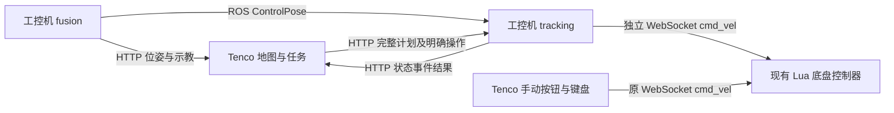

# 工控机控制闭环与位姿直连系统开发方案

> V3，2026-09-18。依据用户最新约定修订：不修改现有 Lua；手动直连无需许可；工控机自动运行独立于上位机及手动输入；本车轮距 0.25 m、轮径 0.20 m。
> V2 保留为历史记录；其控制权互锁、自动租约、上位机失联暂停等要求不再适用。本文件定义当前配套实现，现场验证结果另记开发记录。

## 1. 目标与边界

1. Tenco 负责地图、全局寻路、路线/单垄/多垄任务编译、整项下发、位姿展示和结果监视。
2. 工控机 fusion 发布权威控制位姿；tracking 独立完成 Pure Pursuit、速度规划、转向、停稳、循环与执行保护。
3. 上位机 RouteFollower 和旧逐段作业网关删除，不保留第二套自动跟踪实现或运行时切换开关。
4. 手动仍由原按钮、键盘、速度设置及心跳经 WebSocket 直达底盘。无需请求底盘或 tracking 的许可。
5. 自动使用单独的底盘连接；不读取手动状态，不依赖 Tenco 在线、续约或退出状态，不增加两路仲裁。
6. 保留本通道定位/反馈新鲜度、通信、控制周期、持久化和重启保护。首次自动启动及故障后的恢复必须明确操作。
7. 不修改 `script/` 中任何文件，不部署或操纵实车完成本地测试。

## 2. 参数与配置

| 参数 | 统一值/来源 |
|---|---|
| 轮距（左右轮中心距） | 0.25 m |
| 左右有效轮径 | 各 0.20 m |
| 轮端每圈 ticks | 65536；Lua 已处理减速比 25 |
| 共享车辆配置 | control_common/config/<profile>/vehicle_calibration.json |
| 融合后备配置 | sensor_fusion/config/params.yaml；运行时被合法共享几何覆盖 |
| Tenco 几何与 PP 参数 | 只从工控机读取，不保存第二套自动控制参数 |
| 正式模板 | commissioning，几何已给定；其余标定、定位策略和场地参数仍需核实 |
| 仿真模板 | simulation，仅用于回环仿真；生产拒绝 simulationOnly |

`tracking.yaml` 保留控制频率、速度、前视、停稳、位姿和反馈超时、发送截止期、文件及监听地址。删除 chassis_capabilities 文件与 auto_lease_ms。`request_session.timeout_ms` 只控制后续任务 API 写操作的有效性，不是自动运行保活。

默认控制 20 Hz；本地命令有效期 150 ms；状态和反馈有效期统一 350 ms，硬失联 1000 ms；控制周期超期门限 100 ms；请求会话 1000 ms。这些属于软件默认值，现场须按设备实测整定，不能据此声称已有实车停车精度。

## 3. 组件与数据流



fusion 的 ROS 与 HTTP 来自同一控制快照。tracking 不链接融合算法实现、不接受手动转发。Tenco 的客户端生命周期和页面切换不会推进任务状态；仅明确任务按钮调用 start/resume/pause/abort/estop/reset_fault。

默认端点：fusion HTTP 18131、tracking HTTP 18130、底盘 WS 1202。设备地址从配置读取；测试只用 127.0.0.1。生产对外 HTTP 监听配置 Bearer 认证，默认回环监听。

## 4. 独立控制与既有 Lua 接口

两端各用自己的 WebSocket 连接，均发送原有格式：

```json
{"packet":{"cmd":"region","region":"cmd_vel","index":1},"msg":{"xvel":0.2,"yvel":0.0,"thetavel":0.0,"isRemote":true}}
```

`xvel` 为 m/s，`thetavel` 为 rad/s，`yvel=0`。`isRemote=true` 表示现有脚本的外部速度入口，两端均采用该入口。删除 tenco-control-v1、owner/epoch、手动申请、自动申请/释放和底盘锁存回包；不制造兼容状态。

手动通道保留输入合成、按住心跳、松键零速、显式停止、断线清空输入及重连不回放。空闲后台错误清理不反复发零速；显式停止按钮可直接发零速。手动操作不调用任务暂停，自动启动不清空手动输入、不检查手动连接。

自动通道只保留最新命令，发出前及进行中的写入都有截止限制；断线清理队列。`connectionId` 是本地连接标识，用于丢弃旧连接命令，不放进报文，也不冒充底盘 bootId。Idle/Ready/Paused/终态不持续发零速；任务停止事件发本通道零速，执行中的 Waiting 可继续发零速。

IPC 的实测速度来自 `ControlPose.measuredTwist` 编码器数据，检查有效性和年龄，不用指令速度冒充实测。WebSocket 在线仅证明连接，不能证明硬件模式、控制权或锁存状态。现有 Lua 的接收超时机制保持原实现；本地截止期不宣称为底盘 TTL。

关闭 Tenco 停止本机客户端和手动发送，不向 tracking 发送暂停。普通行驶、转向、定时等待和循环继续独立执行。拍照 external_ack 仍由外部业务执行，缺少确认则按步骤等待/超时，本次不迁移相机业务。

## 5. 坐标系、车辆几何和原点管理

### 5.1 坐标契约

控制标准：`frameId=map` 为 WGS84 原点建立的局部 ENU 米制平面，X 向东、Y 向北；yaw=0 沿 +X，逆时针为正，弧度，归一化到 `[-π,π)`。

`baseFrameId=base_link` 定义在左右驱动轮轴中心，X 向车前、Y 向车左。现有融合参考点若为质心或天线，使用已标定刚性外参变换到该点；旋转引起的参考点速度差也必须处理。

Tenco 的显示坐标、历史地图坐标和控制坐标分别命名，禁止仅因都叫 map 就直接混用：

- 新增 `MapFrameAdapter`，集中进行位姿显示和任务点列的双向变换。
- 原有 `MapGeometry::mapToStandardPoint/Angle` 是现有图形约定的转换，不自动视为 ENU 标定结果。
- 文档中保存 `mapId、mapRevision、originRevision、frameTransformRevision`；新地图控制几何以 ENU 为持久化标准，图形旋转只影响显示。
- 旧地图导入先识别版本和原有坐标含义，预览标定点/方向并转换一次；无法确认的文件标为“需重新绑定坐标”，禁止静默下发。
- 用原点、东向点、北向点、车头方向和一个旋转动作验证变换，不能只验证两个原点经纬度相等。
- 地理点与 ENU 转换统一使用 WGS84 局部切平面实现；若保留简化投影，必须给出工作范围误差上界并纳入精度预算。

### 5.2 标定单一来源

本车固定轮距 **0.25 m**，左右轮径均为 **0.20 m**。轮端每圈 **65536 ticks**；现有 Lua 已除减速比 25，上层不再重复除。`commissioning`、`simulation` 的共享 JSON 与 `sensor_fusion/config/params.yaml` 使用同一几何值。共享合法几何进入融合参数，不以 `verified=false` 为由退回另一套轮距。其余未测标定不伪设为 verified。

工控机 `vehicle_calibration.json` 保存 `calibrationId`、轮距、左右有效轮径、ticks 定义、减速比口径、天线/IMU到 base_link 外参、车体外廓和标定日期。fusion 与 tracking 读取同一文件；Tenco 从服务读取展示/校验用副本，不独立维护自动控制几何。

轮速关系为 `v_left = v - ω*b/2`、`v_right = v + ω*b/2`，b 是轮距。左右尺度不同可分别标定。PP 直接输出 v/ω 时不额外乘除轮距；轮距用于底盘/编码器换算与轮速约束。

配置缺失、非有限、符号错误、版本不一致时，不使用静默默认值启动自动。第一版可沿用已有可校核标定数值，但必须产出一份统一标定记录。

### 5.3 原点文件与生效状态

工控机维护原点文件，路径从配置读取；示例 `/var/lib/tenco/origin.json`：

```json
{
  "schemaVersion": 1,
  "originRevision": "origin-20260915-01",
  "latitude": 30.7064768,
  "longitude": 120.4976352,
  "altitude": 0.0,
  "datum": "WGS84",
  "frameId": "map"
}
```

示例坐标仅用于说明，不作为实车部署值。文件通过临时文件、同步和原子替换落盘；首装可由部署配置初始化，之后损坏文件导致明确故障，禁止悄悄回退另一个原点。

`GET /origin` 同时返回运行中的 `active`、落盘待生效的 `pending`、`restartRequired` 和融合 BootId。运行态的 active 来自 fusion 实际加载结果，不能用文件回读冒充运行进程已更新。

### 5.4 原点更新流程

1. 停车、结束/撤销当前自动执行，禁止新自动任务；校验经纬度、基准和当前原点版本。
2. Tenco 将新原点保存到 tracking 的原点管理模块，形成 pending revision；写失败不修改本地 active。
3. Tenco 展示 pending；不向底盘写 GPS 文件或旧位姿寄存器。
4. 通过明确运维入口重启 fusion；tracking 自身保持服务和安全监视。不得把现有底盘 reboot 命令当成重启融合节点。
5. 读取 fusion 的实际 active revision、健康与控制位姿；全部匹配且车辆仍停稳后激活 Tenco 的本地原点副本。更新期间发生手动移动则暂停激活，重新停稳后复核，不把旧的停稳确认继续沿用。
6. 旧地图、示教点、已上传任务按 revision 失效；显式重绑定/坐标重投影或重新示教，禁止把旧局部点原样当成新原点数据。

更新中断可重试或按记录回退 pending，但不能混用新旧 active。原点变更不支持运动中热更新。原点配置仅在工控机侧维护。

## 6. 控制位姿与示教服务

### 6.1 一个控制样本，两种传输

在现有 `sensor_fusion` 包新增 `msg/ControlPose.msg` 及对应纯数据快照，tracking 只依赖其消息接口，不链接融合实现库。消息中包含版本、时间、位姿、速度和有效性；HTTP 从同一份不可变快照序列化。

ROS 话题 `/sensor_fusion/control_pose` 为唯一生产控制源，使用 KeepLast(1)、volatile、best_effort，双方 QoS 明确一致。状态变化按需发布；位姿发布目标 50 Hz，但不得伪造位置观测频率。其他 odom 话题作为诊断保留，不设置运行时控制源切换开关。

### 6.2 位姿 JSON

`GET :18131/api/v1/pose?bootId=<id>&since=<seq>&waitMs=100`：有更新返回 200，无更新返回 204；BootId 不同立即返回当前快照，不能等待旧进程序号追平。未初始化返回 503 并附原因。

```json
{
  "apiVersion": 1,
  "bootId": "fusion-boot-001",
  "seq": "1284567",
  "originRevision": "origin-20260915-01",
  "calibrationId": "vehicle-cal-001",
  "frameId": "map",
  "baseFrameId": "base_link",
  "clockDomain": "system",
  "stateTime": 1789440000.120,
  "positionObservationTime": 1789440000.100,
  "headingObservationTime": 1789440000.120,
  "sendTime": 1789440000.125,
  "positionObservationAgeMs": 25,
  "headingObservationAgeMs": 5,
  "pose": {"x": 12.345, "y": -6.789, "yaw": 1.5708},
  "estimatedTwist": {"v": 0.25, "omega": 0.01},
  "measuredTwist": {"v": 0.248, "omega": 0.012, "ageMs": 20, "valid": true},
  "validForControl": true,
  "localizationMode": "nominal",
  "positionReliable": true,
  "headingReliable": true,
  "positionStdMeters": 0.02,
  "headingStdRad": 0.02,
  "uncertaintySource": "calibrated_estimate",
  "outputMode": "tracking",
  "reasonCodes": []
}
```

- seq 等 uint64 标识在 JSON 中用十进制字符串，ROS 消息使用 uint64；枚举和单位两边一致。
- `stateTime` 表示该状态实际估计到的时刻；若只外推 100 ms，不能给它标注更晚的目标时间。
- `positionObservationTime` 是最近采纳的位置观测时间，IMU 更新/重复发送旧位置不能刷新它。航向年龄同理，需能追溯到实际采纳信息。
- 每次状态估计或健康变化可产生新 seq；seq 只用于判重，不能单独证明位置新鲜。
- `estimatedTwist.v` 是车体前向有符号速度，不能直接使用世界系 vx 或无符号 hypot。平面同参考点时为 `vx*cos(yaw)+vy*sin(yaw)`。
- `measuredTwist` 来自新鲜编码器/底盘遥测；停车判断不能使用经过静止保持强制归零的展示速度。
- 不确定度无法可靠取得时置 null 并明确来源，禁止编造 quality=0.92 等精度数值；自动准入需要经过验证的不确定度或保守误差界。

### 6.3 统一输出适配

保留融合核心，对输出层做以下有边界改造：

1. 梳理 `centered_smoothed_result`、高频 yaw 更新及 network_sender 的预测/限跳/坐标转换，明确哪些属于控制状态估计、哪些仅用于旧展示。
2. 建立唯一 `ControlPoseBuilder`，在融合事件工作线程生成同步快照；HTTP 线程不反向读取 UKF 可变状态。
3. 固定控制样本的 ENU/base_link 定义，旧地图投影移到 Tenco 的显示/导入适配层。不能把旧 MC 或交换轴的坐标标成 ENU。
4. 输出保持或投影导致位置未观测更新时保留年龄、模式和退化原因；用真值试验检验其控制反馈延迟和横向偏移，不以曲线平滑程度选控制源。
5. 删除 network_sender 前迁移被证明必要的输出保护与时间处理；新位姿发布不得置于 `if (network_sender)` 分支下。

### 6.4 定位健康与新鲜度

`validForControl` 检查初始化/暖机完成、有限数值、坐标/标定正确、融合状态与编码器反馈新鲜、时间未倒退。现有 `FusionResult.valid` 不能直接复制为此字段。RTK 非 FIX、低星、原始位置/航向观测间断、可靠性标志为 false 和单次位置修正只作为降级诊断，不单独阻断控制；共享配置仍须经过确认。

tracking 使用本地 steady_clock 判断接收间隔、命令和控制周期超时；源年龄由 fusion 提供，并叠加本地排队/接收后的时间。实车禁止 use_sim_time；回放使用单独模式并禁用真实底盘输出。跨设备端到端时延测量须先同步时钟并记录偏差，不能直接相减两台未同步机器的时间。

定位状态区分 nominal、degraded、invalid。合法且新鲜的融合估计可持续控制，质量降低时按减速度约束平滑降至 0.10 m/s；原始观测恢复后可平滑恢复任务速度，不要求反复点击继续。原始观测年龄包含接收后的等待时间。状态/编码器反馈共享 350 ms 窗口，超过后暂停，1000 ms 硬失联仍触发故障；时间倒退、非法数值和坐标版本不匹配仍拒绝。不能把低质量定位等同于真实精度已经满足要求。

### 6.5 示教采样

- `POST :18131/api/v1/captures` 提交 requestId、采样时长（默认 1000 ms）、预期原点/标定版本。
- 返回 202 与 captureId；`GET /captures/{captureId}` 返回 running/succeeded/failed、样本数、结果位姿、离散度和原因。
- 采样期间要求实际停稳、定位有效、坐标版本一致；位置采用稳健统计，yaw 使用圆周均值，报告离散度。
- 采样使用不同的真实估计样本，重复发布同一位置不能增加独立位置样本数；最低样本数依据实际位置更新率配置。
- 失败不生成示教点，旧 `RowWorkPendingCaptureTarget` 可保留为 UI 选择状态，网络实现改用 PoseClient。
- 采样是异步任务，不占住位姿长轮询处理线程；结果具有 TTL 和容量上限。

`GET /health` 返回实际 active 原点、标定、fusionBootId、状态/观测频率、各源年龄、健康原因、队列丢帧和输出处理耗时。诊断数据从快照取得，不在 HTTP 回调中锁住融合器。

## 7. 上位机任务编译与统一任务模型

### 7.1 规划和执行的边界

新增可单测的 `TaskCompiler`。它接收当前地图、普通路线队列、RowWorkPlan 或 RowMissionPlan，输出同一种 TaskPlan。图搜索继续复用 RoutePathFinder/MapRoutePlanner；ROS 侧不重跑全局寻路。

| 上位机模式 | 编译结果 |
|---|---|
| 常规路线 | 保留用户任务点的到达/朝向语义，将可连续的地图边组合为 FollowPath；需要停车或改变朝向处显式加 Turn/Wait |
| 单垄单程 | 按检查点将作业线分为 FollowPath，停车检查点后加 Wait |
| 单垄往返 | 去程 FollowPath/Wait → 端点 Turn → 反向点列 FollowPath/Wait → 起点 Turn |
| 多垄 RowLeg | 展开单垄内的路径、检查点与停留 |
| 多垄 Transfer | 编译转场路径，按场地约束设置速度和停车/转向点 |
| 多垄 Turn / Wait | 直接生成转向/停留原语 |

检查点是否在去程/返程启用、循环次数和停留时长由上位机决定并下发；工控机在运行中精确执行，不等待 UI 观察到 progress 后再发停车指令。

### 7.2 步骤类型

只定义三种执行原语：

| 类型 | 字段 | 语义 |
|---|---|---|
| `follow_path` | points、speedLimit、endBehavior、goalToleranceMeters、safetyProfileId | 沿前进方向点列跟踪；结束停稳或衔接下一条路径 |
| `turn` | targetYaw、angularSpeedLimit、angleToleranceRad、rotationZoneId | v=0 原地转向到指定绝对航向；需允许旋转的空间 |
| `wait` | completion、checkpointId | 保持停车，按计时或外部业务确认结束 |

Wait 的 completion 为 `timer(durationMs)` 或 `external_ack(eventType, timeoutMs)`。后者用于现有相机/业务执行：工控机停稳后产生事件，上位机完成业务并确认。超时暂停，不能假定拍摄成功后继续。相机、云台、视频的既有业务模块保留。

### 7.3 TaskPlan 示例

```json
{
  "schemaVersion": 1,
  "requestId": "upload-001",
  "sessionId": "operator-session-001",
  "taskId": "task-001",
  "revision": 1,
  "name": "一号垄巡检",
  "context": {
    "mapId": "greenhouse-a",
    "mapRevision": 3,
    "originRevision": "origin-20260915-01",
    "frameTransformRevision": "enu-001",
    "calibrationId": "vehicle-cal-001",
    "controllerProfileRevision": "tracking-001",
    "frameId": "map"
  },
  "repeat": {"mode": "count", "count": 1},
  "steps": [
    {
      "stepId": "go-checkpoint-1",
      "type": "follow_path",
      "points": [[0.0, 0.0], [1.0, 0.0], [2.0, 0.0]],
      "speedLimit": 0.25,
      "endBehavior": "stop",
      "goalToleranceMeters": 0.03,
      "safetyProfileId": "row-a"
    },
    {
      "stepId": "wait-checkpoint-1",
      "type": "wait",
      "checkpointId": "checkpoint-1",
      "completion": {"type": "timer", "durationMs": 2000}
    },
    {
      "stepId": "go-end",
      "type": "follow_path",
      "points": [[2.0, 0.0], [3.0, 0.0], [4.0, 0.0]],
      "speedLimit": 0.25,
      "endBehavior": "stop",
      "goalToleranceMeters": 0.03,
      "safetyProfileId": "row-a"
    },
    {
      "stepId": "turn-at-end",
      "type": "turn",
      "targetYaw": -3.141592653589793,
      "angularSpeedLimit": 0.35,
      "angleToleranceRad": 0.05,
      "rotationZoneId": "headland-a"
    }
  ]
}
```

上述稀疏点列用于示例；工控机统一预处理采样。repeat 支持 count 和 until_stopped，count 必须大于零；循环复用同一几何，loopIndex 递增，不不断展开数组。

任务不下发 Kp、PP 前视参数、轮距等控制器配置。任务只给出速度/精度/场地约束请求，服务端使用已发布的控制配置和安全上限。任何无法满足的精度或上限组合在执行前拒绝，并返回具体字段和有效范围。

### 7.4 几何预处理和连续衔接

- 删除重复点、拒绝 NaN/Inf、非法单位、零长度路径、断裂路径和超限载荷。
- 由服务端将折线按弧长重采样，初始最大点间距 0.10 m；原始圆弧在上位机按弦误差要求采样。加密折线不能恢复已丢失的圆弧几何。
- 构建累计弧长、切线和曲率信息，避免控制线程反复扫描全路径。
- 普通折线的直角拐点不能靠 PP 自动切角解决：规划时生成满足净空的过渡曲线，或停车后 Turn 再进入下一段。
- `endBehavior=blend` 仅允许紧邻另一个 FollowPath，且两个步骤已预装载、端点/切线/速度约束连续、没有检查点停留、场地允许。服务端合并成连续跟踪区间并保留逻辑步骤边界。
- 连续区间以最后一个 stop 边界为制动目标；中间 blend 边界不能按剩余距离为零而刹停。
- 最后一个步骤或循环末端默认为 stop；第一版不支持循环首尾不停顿衔接。
- 上传时全任务校验，运行时在新步骤开始前复核位置捕获和环境许可；不允许跳过无法进入的步骤。

### 7.5 路径和场地安全参数

每条窄通道/转场路径绑定安全配置，包含可用横向净空、车体外廓、定位误差界、允许捕获偏差、停止偏差、速度上限及原地旋转区域。配置来自现场测量和上位机地图约束，并由工控机校验。

不能把种植行距、通道净宽、轮中心距视为同一宽度。横向安全余量需扣除车体半宽、定位误差、转动扫掠及机械余量。若无可用余量或数据缺失，窄垄任务不允许自动执行。第一版无需构建通用代价地图，但必须有本场地可验证的通行条件。

## 8. Pure Pursuit 与速度规划

### 8.1 模块边界

`PurePursuit` 只处理路径投影、前视点、几何曲率和误差；输入输出均为普通 C++ 数据，不访问 ROS、HTTP、时钟或底盘。`VelocityPlanner` 结合实际 dt、上周期命令、有效实际速度和约束计算速度；`TaskExecutor` 决定当前处于跟踪、制动还是转向。

纯几何模块不通过全局变量保存任务状态。路径进度、上一命令、转向方向和停稳计数由执行器维护，便于重现和测试。

### 8.2 投影和前视点

1. 根据上周期弧长在局部窗口搜索最近线段投影，得到 s、切线方向和带符号横向误差 e。沿行驶方向左侧 e>0，右侧 e<0。
2. 搜索窗口用米和可达进度限制表达，不能依赖固定点数。结合车辆速度和 dt 限制一步进度跳跃；自交、平行贴近和往返重叠路径只在当前步骤范围匹配。
3. 启动/人工接管后恢复时单独进行捕获校验。超出捕获范围则等待人工重新摆位；不在 Tracking 中悄悄全局搜索跳到远处步骤。
4. 用前向速度确定路径弧长前视偏移：

```text
L_s = clamp(L_min + T_lookahead * abs(v_measured), L_min, L_max)
s_target = min(s + L_s, continuous_interval_end)
P_target = interpolate_by_arc_length(path, s_target)
```

L_s 用于选点，不直接作为几何曲率公式的分母。

### 8.3 曲率和符号

将前视点变换到 base_link：

```text
dx = target.x - pose.x
dy = target.y - pose.y
x_L =  cos(yaw) * dx + sin(yaw) * dy
y_L = -sin(yaw) * dx + cos(yaw) * dy
L_d² = x_L² + y_L²
kappa = 2 * y_L / L_d²
omega_target = v_cmd * kappa
```

当 L_d 过小进入终点处理，禁止用极小分母产生大角速度。初始朝向不满足前进跟踪条件时进入 Aligning；若所在区域不允许原地转向，则暂停要求重新摆位。精确反向时 PP 不能自动提供正确对准动作。

第一版不增加额外 cross_gain 补偿。原 v1.0 的正号横向补偿在当前“左正、逆时针正”的约定下会抵消正确纠偏；标准 PP 稳定后若确有持续偏差，先检查标定、轮滑和定位偏差，再单独评估补偿算法。

`headingError` 定义为路径切线与车头夹角；`lookaheadAngle` 为车头到前视点夹角，分别报告。终点目标航向使用独立 Turn，不能把前视角误差当作终点姿态误差。

### 8.4 速度约束

先根据前方曲率和制动位置确定安全速度，再与当前周期的轮速/加速度约束共同求取可执行的 v、ω：

```text
v_curve = sqrt(a_lateral_max / max(abs(kappa_preview), epsilon))
v_yaw   = omega_max / max(abs(kappa), epsilon)
v_wheel = wheel_speed_max / max(abs(1 - kappa*b/2), abs(1 + kappa*b/2))
d_delay = abs(v_measured) * latency_budget + position_margin
d_brake = max(0, distance_to_stop - d_delay)
v_brake = sqrt(2 * decel_guaranteed * d_brake)
v_safe  = min(task_speed_limit, global_speed_limit, v_curve, v_yaw, v_wheel, v_brake)
```

- `kappa_preview` 在前方区间估计；同时考虑 PP 纠偏曲率，避免路径很直但车辆偏离很大时仍高速。
- `decel_guaranteed` 来自实际负载/地面的保守制动能力，不能因为配置填写 0.9 就宣称绝不会超调。
- 正常加减速、角加减速、左右轮约束同时验证。保持曲率可行时使用 `ω=vκ`；若曲率突变导致不可行，按已验证的制动/重新对准策略处理，不独立截断角速度后仍宣称保持原轨迹。
- safety 上限优先于舒适性斜坡限制；需要超出正常减速度才能避险时升级停止方式并记录。
- 使用 steady_clock 测得的 dt；控制周期迟到超限时停止，不能以巨大 dt 补发一串过期速度。
- 停车、暂停和故障制动没有最低速度地板。电机低速死区通过标定和有限终点策略处理，禁止用 `max(v_safe,min_speed)` 强迫持续前进。

### 8.5 终点制动与停稳

接近 stop 边界时进入 Braking，速度目标允许为零。完成必须同时满足：

```text
真实终点欧氏距离 <= goalToleranceMeters
横向偏差处于当前通道允许范围
abs(v_measured) <= settleLinearSpeed
abs(omega_measured) <= settleAngularSpeed
有效停稳条件持续 >= settleDurationMs
```

剩余弧长用于制动和进度，不单独作为到达证明。越过终点但未达到距离条件时停车并报告 `goal_tolerance_failed`，第一版不自动倒车或绕圈追点。

终点航向由后续 Turn 验收；Wait 只有在停稳后才开始计时/发业务事件。到达容差初值 0.03 m，必须与任务可实现性及第 16 节真实精度验收一致。

### 8.6 原地转向

- Turn 使用 v=0 的独立角度控制，带角速度/角加速度限制和角度剩余量制动；不是另一套路径跟踪器。
- 先检查轮轴中心位置、旋转区域和车体扫掠空间，不能仅根据轮距允许转向。
- 目标误差接近 π 时锁定一次旋转方向，避免噪声导致左右方向反复切换。
- angleTolerance、实际角速度停稳阈值和持续时间同时满足后完成；超时/位置漂移超限则故障停车。

### 8.7 初始整定原则

先确认几何和速度尺度，再在宽阔区域验证左右纠偏、起步对准、制动与转向，最后进入窄垄调前视和速度。L_min 初值可以用 0.60 m，但它不是由 0.58 m 轮距推导出的硬下限。只在基准闭环稳定后提高速度，不用新增增益掩盖传感器或坐标错误。

## 9. 执行状态与保护

状态包括 Idle、Ready、Starting、Aligning、Tracking、Braking、Turning、Waiting、Pausing、Paused、Aborting、Completed、Aborted、Fault。上传只进入 Ready；显式启动建立 execution；恢复需重新核对坐标版本及实测停稳，不重放速度。

| 条件/操作 | 本通道行为 |
|---|---|
| start/resume | 校验请求截止期、版本、定位、底盘连接及实测停稳后执行 |
| pause | 制动停稳，保存进度，等待显式恢复 |
| abort | 制动停稳并结束 execution |
| estop | 自动任务进入 Fault，并发一次零速；不声称硬件锁存 |
| reset_fault | 条件恢复且实测停稳后解除本任务故障，不启动车辆 |
| 上位机心跳到期/退出 | 已运行任务继续；到期凭据不能继续写任务 |
| 手动输入 | 不触发自动状态变更 |
| 位姿观测过期 | 既有暂停/故障处理；新鲜预测不能掩盖旧观测 |
| 编码器实测过期、WS 断开或连接变化 | Fault，旧速度不在重连后发送 |
| 控制周期超期、存储失败、融合重启 | 本机停止/故障，明确记录原因 |
| tracking 重启 | 新 bootId；未完成记录标记 Aborted/interrupted，不自行续跑 |

保持任务限制、场地约束、定位误差预算和车体扫掠检查。指定轮径轮距不代表最大轮速、保证制动能力、车体外廓、外参、原点或场地已经测定。commissioning 模板的未验证项继续阻止自动准入。

## 10. HTTP 协议与持久化

API 版本 1，任务 schemaVersion=1；Tenco 配置及地图/作业文件 schemaVersion=2。64 位序号使用十进制字符串。HTTP 写操作带 requestId，重复同正文返回原结果，不同正文冲突；写入超时查询最终结果，不自动重发 start/resume。

| 服务 | 接口（相对 /api/v1） |
|---|---|
| fusion | GET /health、/pose；POST /captures；GET /captures/{id} |
| tracking 只读 | GET /health、/configuration、/status、/tasks/{id}、/executions/{id} |
| 任务写入 | POST /sessions、/sessions/{id}/heartbeat、/tasks、/control |
| 结果与事件 | GET /commands/{id} 或 ?requestId=、/events?after=；POST /events/{id}/ack |
| 原点 | GET /origin；POST /origin，使用 expectedRevision |

任务操作会话和短时 `motionPermit` 仅防止迟到、重复或无效任务写入。start/resume 携带 taskId/revision/executionId、expectedStateVersion、motionPermit、validForMs；不携带 chassisBootId/ownerEpoch。执行循环不接收上位机心跳参数。

状态返回 `controlChannels=independent`、`chassisConnected`、`chassisConnectionId`、任务/执行/步骤、位姿年龄、commandedTwist 及 measuredTwist。实测包含 source=fusion-encoder、valid、ageMs；删除 controlOwner 等虚构控制权字段。

磁盘存储完整计划、摘要、命令去重结果、execution 进度/终态及有序事件。启动检查中断记录；事件补读有容量边界。拍照 intent 和结果持久化，结果未知时不自动重拍；恢复确认绑定具体 eventId。

## 11. 模块、线程与生命周期

工控机 `control_common` 提供控制类型/JSON/配置、位姿/示教/HTTP 与存储；`tracking_node` 提供路径预处理、PP、速度规划、TaskExecutor、ChassisClient、TrackingService。ROS 层只做消息转换，standalone 复用相同业务实现。

控制线程按固定周期运行，不同步等待网络或磁盘。ROS 接收更新最新位姿；网络事件循环管理请求及 WS，存储工作队列有界。断开、取消、超时与退出处理按连接身份保护回调；停机发本通道零速并有界排空，线程退出后释放对象。

Tenco `TaskCompiler/MapFrameAdapter` 位于模型库，`PoseClient/TrackingClient/ChassisClient` 位于网络层。`ControlSessionCoordinator` 只协调任务与坐标绑定，移除底盘/手动对象依赖。`MotionCommandArbiter` 只合成手动输入。界面只在 Qt 主线程更新。

删除 RouteFollower、RowWorkClient、旧逐段执行网关及旧底盘控制权接口；不保留透传空壳。地图/视频/数据库等无关业务不重构。配置迁移保留旧文件备份，不保留第二套运行实现。

## 12. 部署与回退

两个独立 Git 仓库各在新分支开发，成套记录 Tenco 和 IPC 完整 SHA、配置版本、API 版本及安装 SHA256。发布清单标识底盘协议 `legacy-cmd-vel`。Lua 全目录摘要与修改前一致。

Windows 验证 Qt 固定 Kit、纯算法和真实网络服务仿真；Linux ROS 2 Humble CI 构建 control_common、furrow_msgs、sensor_fusion、tracking_node，验证 Debug 测试及可迁移的 RelWithDebInfo 安装。Jetson ARM64、实际 JetPack/ROS/设备驱动仍在目标机核实。

生产由 systemd 管理 fusion 与 tracking，不让 fusion 故障直接杀掉 tracking 的状态服务。禁止 launch 与 systemd 重复拉起进程；首装模板不自动启动车辆。升级先中止任务并确认停稳，检查本机任务状态、连接、实测年龄/速度及配置摘要后切换，不检查已经移除的控制权。

回退同样停稳后切换配套源码/安装/配置版本及地图备份；旧 V2 所需的扩展底盘协议不适配当前 Lua，不能作为当前独立通道版本的直接运行回退目标。重启服务只恢复查询，不恢复运动。

## 13. 测试与验收

| 层次 | 必验内容 |
|---|---|
| 参数 | 两种共享配置和融合后备参数为 0.25/0.20/65536；其余未验证项仍拒绝上线 |
| 纯 C++ | 路径、PP 符号、轮速/速度边界、终点制动、转向、循环、状态机、位姿年龄、示教、存储和会话 |
| Qt | 无许可回包也直接发旧 cmd_vel；松键/显式停止/断线恢复；空闲不重复发送；任务/地图/配置回归 |
| 服务仿真 | 只接受既有 Lua 格式，无 controlState/grant；自动无需上位机保活；编码器过期故障；重连不重放；进程重启不运动 |
| 跨仓联调 | 实际 Qt 客户端下发，行驶/暂停/恢复/端点拍照；Qt 退出后后续自动任务仍完成 |
| GUI | 首页、路线/单垄/多垄页、缩放、维护、帮助、关于及正常退出 |
| 发布 | 清单防篡改、路径限制、未标定模板拒绝、真实停稳检查 |
| Lua | 修改前后全目录文件清单及 SHA256 一致 |

现场另验左右轮方向、轮径轮距生效、编码器速度尺度、定位误差、实测制动/通信时延、长时间运行和独立测量的路径精度。本地及 CI 通过不等于实车已部署。

## 14. 实施与交付记录

按两个仓库 `docs/develop/独立控制通道与车辆参数统一开发方案.md` 分步实施，并在同名开发记录列出基线、失败回归、构建/测试命令与实际结果、提交及 PR。本方案只描述最终目标与实现契约，测试完成情况以开发记录为准。
